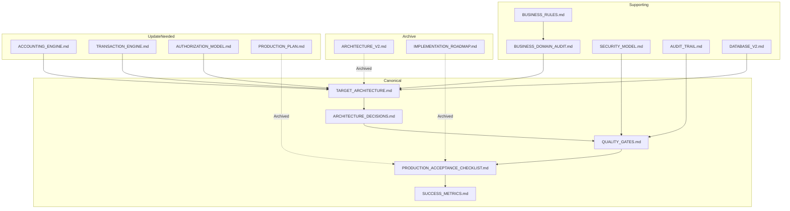

# Architectural Foundation — Documentation Review & Source of Truth

> **Status:** Active  
> **Date:** 2026-07-29  
> **Author:** Principal Architect  
> **Purpose:** Review all existing documentation, identify conflicts, and establish the canonical source of truth going forward.

---

## 1. Document Inventory

The following documents exist in the repository as of July 2026:

### Legacy Documents (existing before architecture work)

| Document                    | Focus                                             | Status                   |
| --------------------------- | ------------------------------------------------- | ------------------------ |
| `ACCOUNTING_ENGINE.md`      | Accounting domain logic, double-entry model plans | 🟡 Partially accurate    |
| `TRANSACTION_ENGINE.md`     | Transaction processing pipeline                   | 🟡 Partially accurate    |
| `ARCHITECTURE_V2.md`        | Target architecture v2 design                     | 🟡 Partially accurate    |
| `ARCHITECTURE_REVIEW.md`    | Earlier architecture review findings              | 🟢 Still relevant        |
| `AUTHORIZATION_MODEL.md`    | Authorization model design                        | 🔴 Needs update          |
| `BUSINESS_RULES.md`         | Business rules catalog                            | 🟢 Accurate              |
| `BUSINESS_DOMAIN_AUDIT.md`  | Domain analysis                                   | 🟢 Good reference        |
| `DATABASE_V2.md`            | Database schema v2 plan                           | 🟡 Partially implemented |
| `AUDIT_TRAIL.md`            | Audit logging design                              | 🟢 Accurate              |
| `IMPLEMENTATION_ROADMAP.md` | Implementation plan                               | 🔴 Outdated              |
| `SECURITY_MODEL.md`         | Security architecture                             | 🟡 Partially accurate    |
| `MIGRATION_PLAN.md`         | Migration strategy                                | ⬜ Not started           |
| `PRODUCTION_PLAN.md`        | Production readiness plan                         | 🟡 Useful reference      |

### New Documents (created in this architecture session)

| Document                                 | Focus                                   |
| ---------------------------------------- | --------------------------------------- |
| `TARGET_ARCHITECTURE.md`                 | Complete target production architecture |
| `ARCHITECTURE_DECISIONS.md`              | Architecture Decision Records (14 ADRs) |
| `QUALITY_GATES.md`                       | Engineering quality standards           |
| `PRODUCTION_ACCEPTANCE_CHECKLIST.md`     | Production readiness checklist          |
| `SUCCESS_METRICS.md`                     | Measurable KPIs for all dimensions      |
| `ARCHITECTURE_FOUNDATION.md` (this file) | Documentation review, source of truth   |

---

## 2. Document Conflict Analysis

### Conflict 1: Backend Architecture

| Source                           | Says                                                                | Assessment                   |
| -------------------------------- | ------------------------------------------------------------------- | ---------------------------- |
| **ARCHITECTURE_V2.md**           | Describes the Express/Bun backend as the primary API layer          | ✅ Correct intent            |
| **IMPLEMENTATION_ROADMAP.md**    | References building "API routes" as a future task                   | ⚠️ Understates current state |
| **TARGET_ARCHITECTURE.md** (new) | Frontend calls Express API for mutations, Supabase direct for reads | ✅ Canonical                 |

**Reality:** The Express backend exists but is unused. The architecture _intended_ to use it but the frontend bypasses it.

**Resolution:** TARGET_ARCHITECTURE.md is correct. The existing source files in `src/server/` are the implementation that needs to be activated.

---

### Conflict 2: Accounting Model

| Source                       | Says                                                     | Assessment                           |
| ---------------------------- | -------------------------------------------------------- | ------------------------------------ |
| **ACCOUNTING_ENGINE.md**     | Describes full double-entry accounting system            | ✅ Excellent design, not implemented |
| **BUSINESS_DOMAIN_AUDIT.md** | Identifies gaps in current single-entry implementation   | ✅ Accurate assessment               |
| **Current codebase**         | Income/expense are single-entry rows, no journal entries | 🟡 Matches AUDIT finding             |

**Reality:** The accounting engine document describes what should exist. The domain code in `src/server/domain/journal.ts` implements it. The frontend bypasses it.

**Resolution:** ACCOUNTING_ENGINE.md + ACTUAL DOMAIN CODE are the authoritative model. The frontend implementation is what needs to change.

---

### Conflict 3: Database Schema

| Source                                  | Says                                                                              | Assessment                      |
| --------------------------------------- | --------------------------------------------------------------------------------- | ------------------------------- |
| **DATABASE_V2.md**                      | Describes an expanded schema with journal entries, audit trail, period management | ✅ Target state                 |
| **Drizzle schema (`src/db/schema.ts`)** | Has income, expenses, offerings, funds, members, etc.                             | ✅ Current state                |
| **Supabase production DB**              | May differ from Drizzle schema                                                    | 🔴 Unknown — needs verification |

**Reality:** The Drizzle schema is simpler than DATABASE_V2.md describes. Journal entries, audit logs, and period tables may need to be added.

**Resolution:** DATABASE_V2.md is the target. Drizzle schema is the current implementation. Migration scripts should bridge the gap.

---

### Conflict 4: Authorization Model

| Source                                 | Says                                                           | Assessment        |
| -------------------------------------- | -------------------------------------------------------------- | ----------------- |
| **AUTHORIZATION_MODEL.md**             | Describes role-based access (Admin, Treasurer, Editor, Viewer) | 🟢 Intended model |
| **Current codebase (`RoleGuard.tsx`)** | Simple role-checking component                                 | 🟡                |
| **Supabase RLS policies**              | Partial implementation of role-based access                    | 🔴 Needs audit    |

**Reality:** Roles exist in the schema and UI but RLS policies may not fully enforce them.

**Resolution:** AUTHORIZATION_MODEL.md remains the target. RLS policies need auditing and reinforcement.

---

### Conflict 5: Production Plan

| Source                                       | Says                                 | Assessment                                                    |
| -------------------------------------------- | ------------------------------------ | ------------------------------------------------------------- |
| **PRODUCTION_PLAN.md**                       | Lists tasks for production readiness | 🟡 Good reference but task-oriented not architecture-oriented |
| **TARGET_ARCHITECTURE.md** (new)             | Architecture-first approach          | ✅ Canonical                                                  |
| **PRODUCTION_ACCEPTANCE_CHECKLIST.md** (new) | Comprehensive verification checklist | ✅ Canonical                                                  |

**Resolution:** PRODUCTION_ACCEPTANCE_CHECKLIST.md supersedes PRODUCTION_PLAN.md for production readiness verification.

---

### Conflict 6: Implementation Priorities

| Source                                                 | Says                                                        | Assessment                      |
| ------------------------------------------------------ | ----------------------------------------------------------- | ------------------------------- |
| **IMPLEMENTATION_ROADMAP.md**                          | Ordered implementation plan                                 | 🔴 Based on older understanding |
| **Production Readiness Assessment (earlier analysis)** | Phase 1: Server activation, storage migration, double-entry | ✅ Current priority             |

**Resolution:** The earlier Production Readiness Assessment analysis (Phases 1-4) is the current priority order. IMPLEMENTATION_ROADMAP.md becomes a reference.

---

## 3. Document Health Summary

| Status                     | Documents                                                                                                                              | Action                                                        |
| -------------------------- | -------------------------------------------------------------------------------------------------------------------------------------- | ------------------------------------------------------------- |
| 🟢 **Keep & promote**      | `BUSINESS_RULES.md`, `BUSINESS_DOMAIN_AUDIT.md`, `AUDIT_TRAIL.md`, `ARCHITECTURE_REVIEW.md`                                            | Update if architecture changes                                |
| 🟡 **Update needed**       | `ACCOUNTING_ENGINE.md`, `TRANSACTION_ENGINE.md`, `ARCHITECTURE_V2.md`, `AUTHORIZATION_MODEL.md`, `DATABASE_V2.md`, `SECURITY_MODEL.md` | Align with TARGET_ARCHITECTURE.md and actual implementation   |
| 🔴 **Outdated/deprecated** | `IMPLEMENTATION_ROADMAP.md`                                                                                                            | Archive or rewrite based on TARGET_ARCHITECTURE.md priorities |
| 🟢 **New canonical docs**  | `TARGET_ARCHITECTURE.md`, `ARCHITECTURE_DECISIONS.md`, `QUALITY_GATES.md`, `PRODUCTION_ACCEPTANCE_CHECKLIST.md`, `SUCCESS_METRICS.md`  | Source of truth going forward                                 |

---

## 4. Recommended Source of Truth

### Tier 1: Primary Sources (always use these)

| Order | Document                       | Authority                  |
| ----- | ------------------------------ | -------------------------- |
| 1     | **Codebase** (files in `src/`) | What actually exists       |
| 2     | **TARGET_ARCHITECTURE.md**     | What we're building toward |
| 3     | **ARCHITECTURE_DECISIONS.md**  | Why we made each decision  |
| 4     | **QUALITY_GATES.md**           | How we ensure quality      |

### Tier 2: Supporting Sources (reference as needed)

| Document                               | When to Reference                      |
| -------------------------------------- | -------------------------------------- |
| **BUSINESS_RULES.md**                  | When implementing business logic       |
| **BUSINESS_DOMAIN_AUDIT.md**           | When analyzing domain model gaps       |
| **AUDIT_TRAIL.md**                     | When implementing audit logging        |
| **SUCCESS_METRICS.md**                 | When configuring monitoring dashboards |
| **PRODUCTION_ACCEPTANCE_CHECKLIST.md** | Before production deployment           |
| **SECURITY_MODEL.md**                  | When implementing security controls    |

### Tier 3: Archive (historical reference)

| Document                      | Reason                                                       |
| ----------------------------- | ------------------------------------------------------------ |
| **IMPLEMENTATION_ROADMAP.md** | Superseded by the Production Readiness Assessment phase plan |
| **ARCHITECTURE_V2.md**        | Superseded by TARGET_ARCHITECTURE.md                         |

### Tier 4: Update Candidates (update when implementing related tasks)

| Document                   | Update Timing                                                      |
| -------------------------- | ------------------------------------------------------------------ |
| **ACCOUNTING_ENGINE.md**   | After double-entry is wired                                        |
| **TRANSACTION_ENGINE.md**  | After API activation                                               |
| **AUTHORIZATION_MODEL.md** | After RLS audit                                                    |
| **DATABASE_V2.md**         | After schema migrations                                            |
| **PRODUCTION_PLAN.md**     | Can be archived after PRODUCTION_ACCEPTANCE_CHECKLIST.md is in use |

---

## 5. Key Observations from Documentation Review

### What's Good

1. **Business domain analysis** (`BUSINESS_DOMAIN_AUDIT.md`) is thorough and accurate.
2. **Accounting engine design** (`ACCOUNTING_ENGINE.md`) is well-thought-out and the domain code reflects it.
3. **Security model** (`SECURITY_MODEL.md`) correctly identifies risks.
4. **Audit trail design** (`AUDIT_TRAIL.md`) is complete and implementable.

### What Needs Work

1. **Multiple documents describe different versions of the same architecture.** ARCHITECTURE_V2.md, ACCOUNTING_ENGINE.md, and IMPLEMENTATION_ROADMAP.md all describe partially overlapping plans that don't fully agree.
2. **The documentation describes the _intended_ architecture, while the codebase is the _actual_ architecture.** These differ significantly, creating confusion.
3. **No single document was the authoritative source of truth.** The ARCHITECTURE_FOUNDATION.md package resolves this.

### Recommended Cleanup

1. **Archive** `IMPLEMENTATION_ROADMAP.md` and `ARCHITECTURE_V2.md` by adding an "ARCHIVED" header.
2. **Update** `ACCOUNTING_ENGINE.md`, `TRANSACTION_ENGINE.md`, and `AUTHORIZATION_MODEL.md` after their corresponding implementation work.
3. **Reference** `DATABASE_V2.md` as the target when planning schema migrations.
4. **Use** `PRODUCTION_ACCEPTANCE_CHECKLIST.md` as the single production gate document.

---

## 6. Document Dependency Map

---

## 7. Final Notes

1. **The new documents (TARGET_ARCHITECTURE.md, ARCHITECTURE_DECISIONS.md, QUALITY_GATES.md, PRODUCTION_ACCEPTANCE_CHECKLIST.md, SUCCESS_METRICS.md) form a complete, consistent architectural foundation.**
2. **They supersede any conflicting statements in legacy documents.**
3. **Legacy documents that remain accurate (BUSINESS_RULES.md, AUDIT_TRAIL.md, etc.) are complementary and should be kept.**
4. **The codebase should always be the ground truth. When documents disagree with code, update the documents to match the code, then update the code to match the target architecture.**

---

_This concludes the architectural foundation phase. Grace Ledger now has a complete, consistent, and reviewable architectural basis ready for implementation._
