# Grace Ledger — Target Production Architecture

**Version:** 1.0
**Date:** July 29, 2026
**Status:** Approved Target Architecture
**Author:** Principal Architect

---

## Table of Contents

1. [Architecture Overview](#1-architecture-overview)
2. [Frontend Architecture](#2-frontend-architecture)
3. [Backend Architecture](#3-backend-architecture)
4. [Domain Layer](#4-domain-layer)
5. [API Layer](#5-api-layer)
6. [AI Gateway](#6-ai-gateway)
7. [Authentication Flow](#7-authentication-flow)
8. [Authorization Flow](#8-authorization-flow)
9. [Database Architecture](#9-database-architecture)
10. [Storage Architecture](#10-storage-architecture)
11. [Integration Architecture](#11-integration-architecture)
12. [Deployment Architecture](#12-deployment-architecture)
13. [Monitoring Architecture](#13-monitoring-architecture)
14. [Disaster Recovery Architecture](#14-disaster-recovery-architecture)

---

## 1. Architecture Overview

### 1.1 High-Level System Diagram

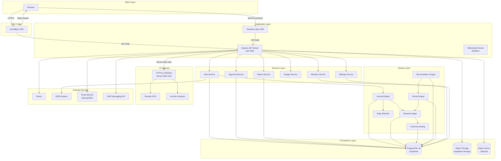
```mermaid
graph TB
    subgraph "Client Layer"
        B[Browser]
    end

    subgraph "CDN / Edge"
        CDN[Cloudflare CDN]
    end

    subgraph "Application Layer"
        direction TB
        SSR[TanStack Start SSR]
        API[Express API Server<br/>port 3001]
        WS[WebSocket Server<br/>Realtime]
    end

    subgraph "Domain Layer"
        JE[Journal Engine]
        GL[General Ledger]
        FA[Fund Accounting]
        SM[State Machine]
        RE[Reconciliation Engine]
        PE[Period Engine]
    end

    subgraph "Services Layer"
        AS[Auth Service]
        APS[Approval Service]
        RS[Report Service]
        BS[Budget Service]
        MS[Member Service]
        SVC[Settings Service]
    end

    subgraph "AI Gateway"
        direction TB
        AG[AI Proxy Gateway<br/>Server-Side Only]
        OCR[Receipt OCR]
        VOUCHER[Voucher Analysis]
    end

    subgraph "Persistence Layer"
        PG[(PostgreSQL 16<br/>Supabase)]
        STORAGE[(Object Storage<br/>Supabase Storage)]
        REDIS[(Redis Cache<br/>Optional)]
    end

    subgraph "External Services"
        SENTRY[Sentry]
        SIEM[SIEM System]
        EMAIL[Email Service<br/>Resend/SES]
        LINE[LINE Messaging API]
    end

    B -- HTTPS --> CDN
    CDN -- Static Assets --> B
    CDN -- API Calls --> API
    B -- Server Functions --> SSR
    SSR -- API Calls --> API

    API --> AS
    API --> APS
    API --> RS
    API --> BS
    API --> MS
    API --> SVC

    AS --> JE
    JE --> GL
    GL --> FA
    JE --> SM
    RE --> PE
    PE --> GL

    API -- Server-Side Only --> AG
    AG --> OCR
    AG --> VOUCHER

    AS --> PG
    APS --> PG
    RS --> PG
    JE --> PG
    GL --> PG
    FA --> PG
    RE --> PG
    PE --> PG
    MS --> PG
    SVC --> PG

    API --> STORAGE
    API --> REDIS

    API --> SENTRY
    API --> EMAIL
    API --> LINE
    AS --> SIEM
```

### 1.2 Communication Flow

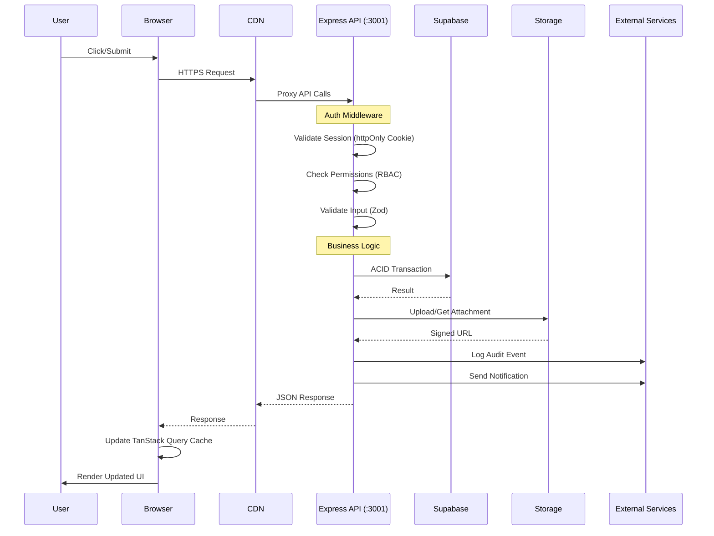
```mermaid
sequenceDiagram
    participant User
    participant Browser
    participant CDN
    participant ExpressAPI as Express API (:3001)
    participant Supabase
    participant Storage
    participant External as External Services

    User->>Browser: Click/Submit
    Browser->>CDN: HTTPS Request
    CDN->>ExpressAPI: Proxy API Calls

    Note over ExpressAPI: Auth Middleware
    ExpressAPI->>ExpressAPI: Validate Session (httpOnly Cookie)
    ExpressAPI->>ExpressAPI: Check Permissions (RBAC)
    ExpressAPI->>ExpressAPI: Validate Input (Zod)

    Note over ExpressAPI: Business Logic
    ExpressAPI->>Supabase: ACID Transaction
    Supabase-->>ExpressAPI: Result

    ExpressAPI->>Storage: Upload/Get Attachment
    Storage-->>ExpressAPI: Signed URL

    ExpressAPI->>External: Log Audit Event
    ExpressAPI->>External: Send Notification

    ExpressAPI-->>CDN: JSON Response
    CDN-->>Browser: Response
    Browser->>Browser: Update TanStack Query Cache
    Browser->>User: Render Updated UI
```

### 1.3 Architectural Principles

| Principle                  | Description                                                      | Rationale                                                              |
| -------------------------- | ---------------------------------------------------------------- | ---------------------------------------------------------------------- |
| **Server-Side Authority**  | No business logic executes on the client                         | Browser is untrusted; financial integrity requires server enforcement  |
| **Defense in Depth**       | Every boundary enforced at multiple layers                       | No single layer compromise defeats the system                          |
| **Immutable Audit Trail**  | Once recorded, no audit record can be modified or deleted        | Audit compliance; fraud detection; regulatory requirements             |
| **Double-Entry Integrity** | Σ debits = Σ credits is a system invariant                       | Core accounting principle; enforced at DB level with CHECK constraints |
| **Single Source of Truth** | Every piece of data has exactly one authoritative representation | No derived values as source of truth; fund balances stored in GL       |
| **Secrets Zero**           | No API keys, tokens, or secrets in client-side code              | All third-party API calls go through server-side proxy                 |
| **Fail Closed**            | On any authorization/validation failure, deny access             | Security-first approach for financial system                           |
| **Least Privilege**        | Each role gets exactly the permissions needed, nothing more      | Principle of least privilege enforced at every layer                   |

### 1.4 Why These Principles Matter for Church Financial Software

Churches handle **cash, member PII, and tax-reportable donations**. The system must:

1. **Prevent embezzlement** — separation of duties, dual approval, immutable audit trail
2. **Enable external audits** — complete transaction history from any point in time
3. **Comply with Thai tax law** — tax receipts (ใบอนุโมทนาบัตร), 7-year record retention
4. **Protect member privacy** — PDPA compliance for personal data
5. **Survive operator error** — void-only deletion, period locking, reconciliation

Every architectural decision below derives from these requirements.

---

## 2. Frontend Architecture

### 2.1 Component Tree


```mermaid
graph TB
    subgraph "App Shell"
        RL[Root Layout]
        AL[Auth Layout]
        APL[App Layout]
    end

    subgraph "Navigation"
        SB[Sidebar / AppNav]
        TB[Topbar / AppTopbar]
        CP[Command Palette]
    end

    subgraph "Shared Components"
        SC[StatCard]
        MT[MoneyText]
        PP[PinPad]
        RG[RoleGuard]
        OI[OfflineIndicator]
        EB[ErrorBoundary]
        AI[AttachmentInput]
        SK[Skeleton]
    end

    subgraph "Feature Pages"
        D[Dashboard]
        OF[Offerings]
        EX[Expenses]
        IN[Income]
        FU[Funds]
        FT[Fund Transfers]
        BU[Budget]
        PR[Projects]
        ME[Members]
        RC[Reconciliation]
        AU[Audit Log]
        RP[Reports]
        ST[Settings]
        PRF[Profile]
        LS[Line Setup]
    end

    subgraph "State Management"
        TQ[TanStack Query<br/>Server State]
        RH[React Hook Form<br/>Form State]
        ZD[Zod<br/>Validation]
    end

    subgraph "UI Library"
        SH[shadcn/ui]
        RX[Radix UI]
        RC[Recharts]
        LI[Lucide Icons]
        FM[Framer Motion]
    end

    RL --> AL
    RL --> APL
    APL --> SB
    APL --> TB
    APL --> CP
    APL --> SC
    APL --> MT
    APL --> EB

    D --> TQ
    D --> RC
    OF --> TQ
    OF --> RH
    OF --> ZD
    EX --> TQ
    EX --> RH
    EX --> ZD
    FU --> TQ
    RC --> TQ
    RP --> TQ
    RP --> RC

    TQ --> SH
    TQ --> RX
    TQ --> FM
```

### 2.2 Technology Stack (Frontend)

| Technology      | Version | Purpose                                  |
| --------------- | ------- | ---------------------------------------- |
| React           | 19.x    | UI framework                             |
| TypeScript      | 5.x     | Type safety                              |
| TanStack Router | 1.x     | File-based routing, type-safe links      |
| TanStack Query  | 5.x     | Server state management, caching         |
| TanStack Start  | 1.x     | SSR, server functions                    |
| Tailwind CSS    | 4.x     | Utility-first styling                    |
| shadcn/ui       | Latest  | Accessible UI primitives                 |
| Radix UI        | Latest  | Headless component primitives            |
| Recharts        | Latest  | Charting and data visualization          |
| Framer Motion   | Latest  | Declarative animations                   |
| React Hook Form | Latest  | Performant form handling                 |
| Zod             | Latest  | Schema validation (shared client/server) |
| Lucide React    | Latest  | Consistent icon set                      |
| Vite            | 6.x     | Build tooling                            |
| Bun             | Latest  | Package manager and runtime              |

### 2.3 Component Hierarchy

```
src/
├── routes/                   # File-based routing (TanStack Router)
│   ├── __root.tsx            # Root layout (providers, error boundary)
│   ├── _app.tsx              # Authenticated app shell
│   ├── index.tsx             # Landing page / redirect
│   ├── auth.tsx              # Login page
│   ├── auth.register.tsx     # Registration page
│   └── _app.{feature}.tsx   # Feature pages
│
├── components/
│   ├── ui/                   # shadcn/ui base components (button, card, dialog, etc.)
│   ├── layout/               # AppNav, AppTopbar, CommandPalette
│   ├── shared/               # StatCard, MoneyText, PinPad, RoleGuard, etc.
│   └── features/             # Feature-specific components
│       ├── offerings/
│       ├── expenses/
│       ├── funds/
│       ├── reports/
│       └── reconciliation/
│
├── hooks/                    # Custom React hooks
│   ├── useAuth.ts
│   ├── usePermission.ts
│   ├── useRealtime.ts
│   └── use-mobile.tsx
│
├── lib/                      # Shared utilities
│   ├── format.ts             # Currency, date, number formatting
│   ├── utils.ts              # cn(), other helpers
│   ├── constants.ts          # App-wide constants
│   └── types.ts              # Shared TypeScript types
```

### 2.4 State Management Strategy

| State Type   | Tool                      | Notes                                                |
| ------------ | ------------------------- | ---------------------------------------------------- |
| Server state | TanStack Query            | All data from API; cache with stale-while-revalidate |
| URL state    | TanStack Router           | Search params for filters, pagination                |
| Form state   | React Hook Form           | Local to form; Zod validation                        |
| UI state     | React useState/useReducer | Toggles, modals, selections                          |
| Auth state   | React Context             | Session info, user object, permissions               |

---

## 3. Backend Architecture

### 3.1 Layered Architecture

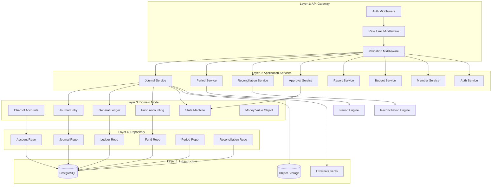
```mermaid
graph TB
    subgraph "Layer 1: API Gateway"
        AM[Auth Middleware]
        RM[Rate Limit Middleware]
        VM[Validation Middleware]
        AM --> RM --> VM
    end

    subgraph "Layer 2: Application Services"
        JS[Journal Service]
        PS[Period Service]
        RS[Reconciliation Service]
        APS[Approval Service]
        RPS[Report Service]
        BDS[Budget Service]
        MS[Member Service]
        ATS[Auth Service]
    end

    subgraph "Layer 3: Domain Model"
        COA[Chart of Accounts]
        JE[Journal Entry]
        GL[General Ledger]
        FA[Fund Accounting]
        SM[State Machine]
        M[Money Value Object]
    end

    subgraph "Layer 4: Repository"
        JR[Journal Repo]
        LR[Ledger Repo]
        AR[Account Repo]
        FR[Fund Repo]
        PR[Period Repo]
        RR[Reconciliation Repo]
    end

    subgraph "Layer 5: Infrastructure"
        DB[(PostgreSQL)]
        ST[(Object Storage)]
        CX[External Clients]
    end

    VM --> JS
    VM --> PS
    VM --> RS
    VM --> APS
    VM --> RPS
    VM --> BDS
    VM --> MS
    VM --> ATS

    JS --> JE
    JS --> GL
    JS --> FA
    JS --> SM
    PS --> PE[Period Engine]
    RS --> RE[Reconciliation Engine]
    APS --> SM

    JE --> JR
    GL --> LR
    COA --> AR
    FA --> FR

    JR --> DB
    LR --> DB
    AR --> DB
    FR --> DB
    PR --> DB
    RR --> DB

    JS --> ST
    JS --> CX
```

### 3.2 Technology Stack (Backend)

| Technology    | Version | Purpose                                 |
| ------------- | ------- | --------------------------------------- |
| Node.js / Bun | Latest  | JavaScript runtime                      |
| Express       | 4.x     | HTTP server; API routes                 |
| TypeScript    | 5.x     | Type safety                             |
| Drizzle ORM   | Latest  | Type-safe SQL; migrations               |
| PostgreSQL    | 16.x    | ACID-compliant database                 |
| Supabase      | Latest  | Managed Postgres, Auth, Storage         |
| Zod           | Latest  | Input validation (shared with frontend) |
| Pino          | Latest  | Structured JSON logging                 |
| Sentry SDK    | Latest  | Error tracking                          |
| Argon2        | Latest  | Password hashing                        |

### 3.3 Server-Side Directory Structure

```
src/server/
├── api/                        # API routes (Express)
│   ├── routes.ts               # Route registration
│   ├── middleware.ts            # Auth, rate limit, validation middleware
│   └── routes/
│       ├── auth.routes.ts
│       ├── journal.routes.ts
│       ├── fund.routes.ts
│       ├── offering.routes.ts
│       ├── expense.routes.ts
│       ├── income.routes.ts
│       ├── period.routes.ts
│       ├── reconciliation.routes.ts
│       ├── budget.routes.ts
│       ├── report.routes.ts
│       ├── member.routes.ts
│       ├── audit.routes.ts
│       ├── settings.routes.ts
│       ├── ai-proxy.routes.ts   # Server-side AI proxy
│       └── health.routes.ts
│
├── domain/                     # Domain models & business rules
│   ├── types.ts                # Shared domain types
│   ├── money.ts                # Money value object (satang-precision)
│   ├── validation.ts           # Shared Zod schemas
│   ├── chart-of-accounts.ts    # COA model, default accounts
│   ├── journal.ts              # Journal entry model, creation rules
│   ├── fund-accounting.ts      # Fund balance management
│   └── transaction-state.ts    # State machine definitions
│
├── services/                   # Application services
│   ├── auth.service.ts
│   ├── audit.service.ts
│   ├── fund.service.ts
│   ├── transfer.service.ts
│   ├── reconciliation.service.ts
│   ├── period.service.ts
│   ├── seed.service.ts
│   └── migration.service.ts
│
├── auth/                       # Authentication & authorization
│   ├── session.ts              # Session validation, JWT handling
│   ├── password.ts             # Password hashing (argon2)
│   └── permissions.ts          # Permission matrix
│
├── infrastructure/             # Infrastructure layer
│   └── db.ts                   # Drizzle client, connection
│
└── __tests__/                  # Backend tests
    └── backend.test.ts
```

### 3.4 Why a Dedicated Express API Server (Not Just Server Functions)

| Criteria               | TanStack Start Server Functions | Express API Server  |
| ---------------------- | ------------------------------- | ------------------- |
| Transaction management | Limited to function scope       | Full control        |
| Middleware chain       | Framework-specific              | Standard Express    |
| Background jobs        | Not suitable                    | Bull/Agenda queues  |
| WebSocket support      | Limited                         | Full (socket.io)    |
| File upload handling   | Basic                           | Multer, streaming   |
| Deployment flexibility | Tied to TanStack Start          | Independent service |
| Rate limiting          | Custom implementation           | express-rate-limit  |

**Decision:** Use TanStack Start Server Functions for SSR and simple server operations. Add an Express API server for all financial mutations, file handling, and integration operations. This separation allows the API server to be deployed independently, scaled separately, and maintained without touching the frontend SSR layer.

---

## 4. Domain Layer

### 4.1 Domain Model Overview

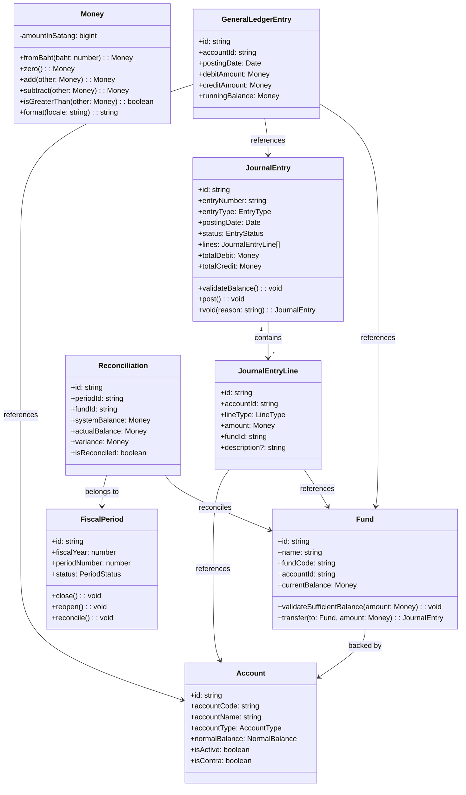
```mermaid
classDiagram
    class Money {
        -amountInSatang: bigint
        +fromBaht(baht: number): Money
        +zero(): Money
        +add(other: Money): Money
        +subtract(other: Money): Money
        +isGreaterThan(other: Money): boolean
        +format(locale: string): string
    }

    class Account {
        +id: string
        +accountCode: string
        +accountName: string
        +accountType: AccountType
        +normalBalance: NormalBalance
        +isActive: boolean
        +isContra: boolean
    }

    class JournalEntry {
        +id: string
        +entryNumber: string
        +entryType: EntryType
        +postingDate: Date
        +status: EntryStatus
        +lines: JournalEntryLine[]
        +totalDebit: Money
        +totalCredit: Money
        +validateBalance(): void
        +post(): void
        +void(reason: string): JournalEntry
    }

    class JournalEntryLine {
        +id: string
        +accountId: string
        +lineType: LineType
        +amount: Money
        +fundId: string
        +description?: string
    }

    class GeneralLedgerEntry {
        +id: string
        +accountId: string
        +postingDate: Date
        +debitAmount: Money
        +creditAmount: Money
        +runningBalance: Money
    }

    class Fund {
        +id: string
        +name: string
        +fundCode: string
        +accountId: string
        +currentBalance: Money
        +validateSufficientBalance(amount: Money): void
        +transfer(to: Fund, amount: Money): JournalEntry
    }

    class FiscalPeriod {
        +id: string
        +fiscalYear: number
        +periodNumber: number
        +status: PeriodStatus
        +close(): void
        +reopen(): void
        +reconcile(): void
    }

    class Reconciliation {
        +id: string
        +periodId: string
        +fundId: string
        +systemBalance: Money
        +actualBalance: Money
        +variance: Money
        +isReconciled: boolean
    }

    JournalEntry "1" --> "*" JournalEntryLine : contains
    JournalEntryLine --> Account : references
    JournalEntryLine --> Fund : references
    GeneralLedgerEntry --> Account : references
    GeneralLedgerEntry --> JournalEntry : references
    GeneralLedgerEntry --> Fund : references
    Fund --> Account : backed by
    Reconciliation --> FiscalPeriod : belongs to
    Reconciliation --> Fund : reconciles
```

### 4.2 Core Domain Invariants

| Invariant                     | Enforcement                               | Consequence of Violation      |
| ----------------------------- | ----------------------------------------- | ----------------------------- |
| Σ debits = Σ credits          | CHECK constraint + application validation | Transaction rejected          |
| Fund balance ≥ 0              | Server-side check at posting              | InsufficientFundsError        |
| Period must be open           | Validation before any journal entry       | PeriodClosedError             |
| Creator ≠ Approver            | Server-side check                         | SelfApprovalError             |
| Approved entries → void only  | State machine enforcement                 | InvalidTransitionError        |
| Prior period reconciled first | Period close algorithm                    | PriorPeriodNotReconciledError |
| Balanced trial balance        | Periodic monitoring check                 | Alert triggered               |

### 4.3 Transaction State Machine

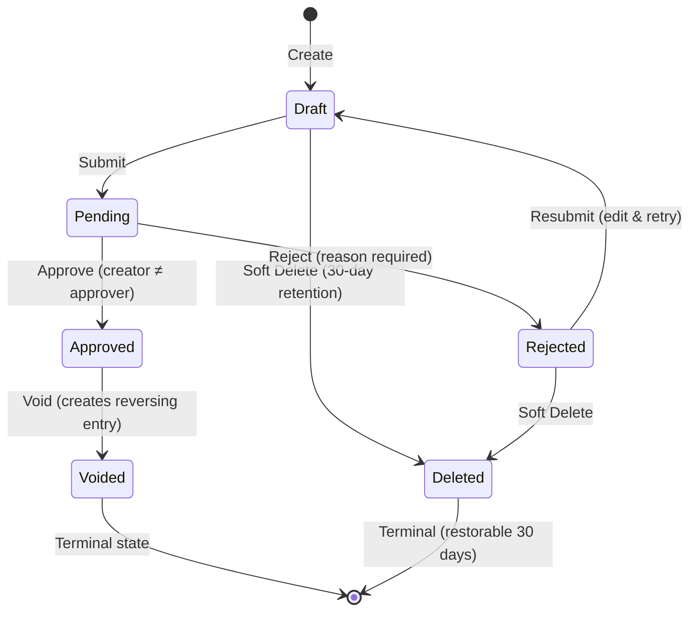
```mermaid
stateDiagram-v2
    [*] --> Draft: Create
    Draft --> Pending: Submit
    Draft --> Deleted: Soft Delete (30-day retention)
    Pending --> Approved: Approve (creator ≠ approver)
    Pending --> Rejected: Reject (reason required)
    Rejected --> Draft: Resubmit (edit & retry)
    Rejected --> Deleted: Soft Delete
    Approved --> Voided: Void (creates reversing entry)
    Voided --> [*]: Terminal state
    Deleted --> [*]: Terminal (restorable 30 days)
```

### 4.4 Money Value Object

The `Money` class is the **single most important domain object** in the system. It ensures:

- **Exact precision** — stored as satang (1/100 THB) using BigInt, never floating-point
- **Immutability** — all operations return new instances
- **Type safety** — cannot accidentally mix Money with plain numbers
- **Locale-aware formatting** — Thai Baht (THB) with proper formatting
- **Zero as default** — `Money.zero()` is the defined empty state

```typescript
// Core monad operations
Money.zero(); // Create zero money
Money.fromBaht(100.5); // Create from decimal (converted to satang)
a.add(b); // Add two money values
a.subtract(b); // Subtract
a.isGreaterThan(b); // Comparison
a.isZero(); // Check zero
a.format("th-TH"); // "฿100.50"
```

---

## 5. API Layer

### 5.1 API Endpoint Map

| Method  | Endpoint                           | Purpose                   | Auth Required | Permission             |
| ------- | ---------------------------------- | ------------------------- | ------------- | ---------------------- |
| `POST`  | `/api/v1/auth/login`               | Login                     | No            | —                      |
| `POST`  | `/api/v1/auth/logout`              | Logout                    | Yes           | —                      |
| `POST`  | `/api/v1/auth/refresh`             | Refresh session           | Yes           | —                      |
| `POST`  | `/api/v1/auth/mfa/verify`          | Verify TOTP               | No            | —                      |
| `GET`   | `/api/v1/auth/me`                  | Current user              | Yes           | —                      |
| `GET`   | `/api/v1/journal`                  | List journal entries      | Yes           | `journal.read`         |
| `POST`  | `/api/v1/journal`                  | Create journal entry      | Yes           | `journal.write`        |
| `GET`   | `/api/v1/journal/:id`              | Get journal entry         | Yes           | `journal.read`         |
| `POST`  | `/api/v1/journal/:id/approve`      | Approve entry             | Yes           | `journal.approve`      |
| `POST`  | `/api/v1/journal/:id/reject`       | Reject entry              | Yes           | `journal.approve`      |
| `POST`  | `/api/v1/journal/:id/void`         | Void entry                | Yes           | `journal.void`         |
| `GET`   | `/api/v1/funds`                    | List funds                | Yes           | `fund.read`            |
| `POST`  | `/api/v1/funds`                    | Create fund               | Yes           | `fund.create`          |
| `GET`   | `/api/v1/funds/:id`                | Fund detail               | Yes           | `fund.read`            |
| `POST`  | `/api/v1/funds/:id/transfer`       | Fund transfer             | Yes           | `fund.transfer`        |
| `GET`   | `/api/v1/offerings`                | List offerings            | Yes           | `offering.read`        |
| `POST`  | `/api/v1/offerings`                | Record offering           | Yes           | `offering.write`       |
| `GET`   | `/api/v1/expenses`                 | List expenses             | Yes           | `expense.read`         |
| `POST`  | `/api/v1/expenses`                 | Create expense            | Yes           | `expense.write`        |
| `GET`   | `/api/v1/members`                  | List members              | Yes           | `member.read`          |
| `POST`  | `/api/v1/members`                  | Create member             | Yes           | `member.write`         |
| `GET`   | `/api/v1/periods`                  | List periods              | Yes           | `period.read`          |
| `POST`  | `/api/v1/periods/:id/close`        | Close period              | Yes           | `period.close`         |
| `GET`   | `/api/v1/reconciliations`          | List reconciliations      | Yes           | `reconciliation.read`  |
| `POST`  | `/api/v1/reconciliations`          | Create reconciliation     | Yes           | `reconciliation.write` |
| `GET`   | `/api/v1/budgets`                  | List budgets              | Yes           | `budget.read`          |
| `POST`  | `/api/v1/budgets`                  | Create budget             | Yes           | `budget.write`         |
| `POST`  | `/api/v1/reports/balance-sheet`    | Generate balance sheet    | Yes           | `reports.financial`    |
| `POST`  | `/api/v1/reports/income-statement` | Generate income statement | Yes           | `reports.financial`    |
| `GET`   | `/api/v1/audit`                    | Query audit log           | Yes           | `audit.read`           |
| `GET`   | `/api/v1/settings`                 | Get settings              | Yes           | `settings.read`        |
| `PATCH` | `/api/v1/settings`                 | Update settings           | Yes           | `settings.write`       |
| `GET`   | `/api/v1/health`                   | Health check              | No            | —                      |

### 5.2 API Response Format

```typescript
// Success Response
{
  "data": T,                    // Response payload
  "meta"?: {                    // Pagination metadata
    "total": number,
    "page": number,
    "pageSize": number
  }
}

// Error Response
{
  "error": {
    "code": string,             // Machine-readable error code
    "message": string,          // Human-readable (Thai + English fallback)
    "correlationId": string,    // For debugging
    "details"?: Record<string, string[]>  // Field-level validation errors
  }
}
```

### 5.3 Standard Error Codes

| Code                 | HTTP Status | Description                      |
| -------------------- | ----------- | -------------------------------- |
| `VALIDATION_ERROR`   | 400         | Input validation failed          |
| `UNAUTHORIZED`       | 401         | Missing or invalid session       |
| `FORBIDDEN`          | 403         | Insufficient permissions         |
| `NOT_FOUND`          | 404         | Entity not found                 |
| `CONFLICT`           | 409         | Optimistic lock version conflict |
| `INSUFFICIENT_FUNDS` | 422         | Fund balance too low             |
| `PERIOD_CLOSED`      | 422         | Period is closed                 |
| `SELF_APPROVAL`      | 422         | Cannot approve own transaction   |
| `INVALID_TRANSITION` | 422         | Invalid state transition         |
| `RATE_LIMITED`       | 429         | Too many requests                |
| `INTERNAL_ERROR`     | 500         | Unexpected error                 |

---

## 6. AI Gateway

### 6.1 Architecture

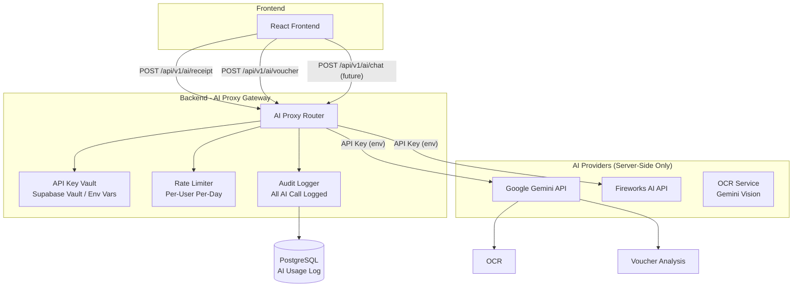
```mermaid
graph TB
    subgraph "Frontend"
        FR[React Frontend]
    end

    subgraph "Backend - AI Proxy Gateway"
        APG[AI Proxy Router]
        APG --> V[API Key Vault<br/>Supabase Vault / Env Vars]
        APG --> RL[Rate Limiter<br/>Per-User Per-Day]
        APG --> AL[Audit Logger<br/>All AI Call Logged]
    end

    subgraph "AI Providers (Server-Side Only)"
        GE[Google Gemini API]
        FW[Fireworks AI API]
        OC[OCR Service<br/>Gemini Vision]
    end

    FR -- "POST /api/v1/ai/receipt" --> APG
    FR -- "POST /api/v1/ai/voucher" --> APG
    FR -- "POST /api/v1/ai/chat (future)" --> APG

    APG -- "API Key (env)" --> GE
    APG -- "API Key (env)" --> FW

    GE --> OCR
    GE --> VOUCHER[Voucher Analysis]

    AL --> DB[(PostgreSQL<br/>AI Usage Log)]
```

### 6.2 Why Server-Side AI Proxy

| Concern          | Client-Side (Current)    | Server-Side Proxy (Target)               |
| ---------------- | ------------------------ | ---------------------------------------- |
| API key exposure | Keys in browser → stolen | Keys in server env vars → secure         |
| Usage tracking   | Impossible               | All calls logged with user, cost, tokens |
| Rate limiting    | Not possible             | Per-user daily quota enforced            |
| Cost control     | No visibility            | Billing dashboard per church             |
| Abuse prevention | None                     | Anomaly detection on usage patterns      |
| Data privacy     | Member data sent to AI   | Full control over what's sent            |

### 6.3 AI Service Architecture

```typescript
// src/server/services/ai-gateway.service.ts

interface AIGatewayConfig {
  userDailyLimit: number;       // Max AI calls per user per day
  churchMonthlyBudget: number;  // Max monthly spend per church
  allowedModels: string[];      // Whitelisted models
}

interface AIUsageRecord {
  userId: string;
  churchId: string;
  service: 'receipt_ocr' | 'voucher_analysis';
  model: string;
  inputTokens: number;
  outputTokens: number;
  estimatedCost: number;
  duration: number;
  status: 'success' | 'error';
  error?: string;
  timestamp: Date;
}

class AIGatewayService {
  async callAI<T>(
    userId: string,
    churchId: string,
    service: string,
    payload: unknown,
    options: { model: string; maxTokens: number }
  ): Promise<T> {
    // 1. Check daily quota
    await this.checkUserQuota(userId, churchId);

    // 2. Log request
    const usage: AIUsageRecord = { userId, churchId, service, ... };

    // 3. Call provider (model name mapped from env)
    const result = await this.callProvider(options.model, payload);

    // 4. Track usage
    await this.recordUsage(usage);

    // 5. Check budget
    await this.checkChurchBudget(churchId);

    return result;
  }
}
```

### 6.4 AI Use Cases

| Use Case         | Provider      | Model            | Data Sent              | Max Cost/Request |
| ---------------- | ------------- | ---------------- | ---------------------- | ---------------- |
| Receipt OCR      | Gemini        | gemini-2.5-flash | Receipt image + prompt | ~$0.01           |
| Voucher analysis | Gemini        | gemini-2.5-flash | Voucher image + prompt | ~$0.01           |
| Chat (future)    | Gemini/OpenAI | gemini-2.5-flash | Conversation text      | Varies           |

---

## 7. Authentication Flow

### 7.1 Login Flow

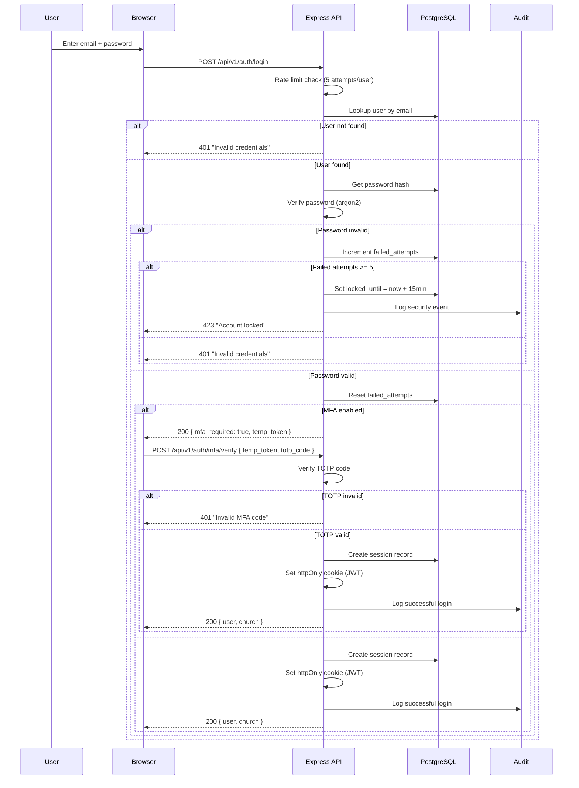
```mermaid
sequenceDiagram
    participant User
    participant Browser
    participant API as Express API
    participant DB as PostgreSQL
    participant Audit

    User->>Browser: Enter email + password
    Browser->>API: POST /api/v1/auth/login
    API->>API: Rate limit check (5 attempts/user)
    API->>DB: Lookup user by email
    alt User not found
        API-->>Browser: 401 "Invalid credentials"
    else User found
        API->>DB: Get password hash
        API->>API: Verify password (argon2)
        alt Password invalid
            API->>DB: Increment failed_attempts
            alt Failed attempts >= 5
                API->>DB: Set locked_until = now + 15min
                API->>Audit: Log security event
                API-->>Browser: 423 "Account locked"
            else
                API-->>Browser: 401 "Invalid credentials"
            end
        else Password valid
            API->>DB: Reset failed_attempts
            alt MFA enabled
                API-->>Browser: 200 { mfa_required: true, temp_token }
                Browser->>API: POST /api/v1/auth/mfa/verify { temp_token, totp_code }
                API->>API: Verify TOTP code
                alt TOTP invalid
                    API-->>Browser: 401 "Invalid MFA code"
                else TOTP valid
                    API->>DB: Create session record
                    API->>API: Set httpOnly cookie (JWT)
                    API->>Audit: Log successful login
                    API-->>Browser: 200 { user, church }
                end
            else
                API->>DB: Create session record
                API->>API: Set httpOnly cookie (JWT)
                API->>Audit: Log successful login
                API-->>Browser: 200 { user, church }
            end
        end
    end
```

### 7.2 Session Management

| Parameter             | Value                               | Rationale                                     |
| --------------------- | ----------------------------------- | --------------------------------------------- |
| Token type            | JWT (stateless verification)        | No DB lookup for basic validation             |
| Token storage         | httpOnly cookie                     | Not accessible to JavaScript (XSS protection) |
| Cookie flags          | Secure, SameSite=Strict             | HTTPS only; CSRF protection                   |
| Session active TTL    | 8 hours (configurable via settings) | Balance security vs convenience               |
| Session idle timeout  | 15 minutes (configurable)           | Auto-logout for unattended devices            |
| Refresh mechanism     | Sliding window                      | Each valid request extends session            |
| Simultaneous sessions | Multiple allowed                    | Different devices/users                       |
| Password change       | Revoke ALL sessions                 | Security measure                              |

### 7.3 MFA Flow

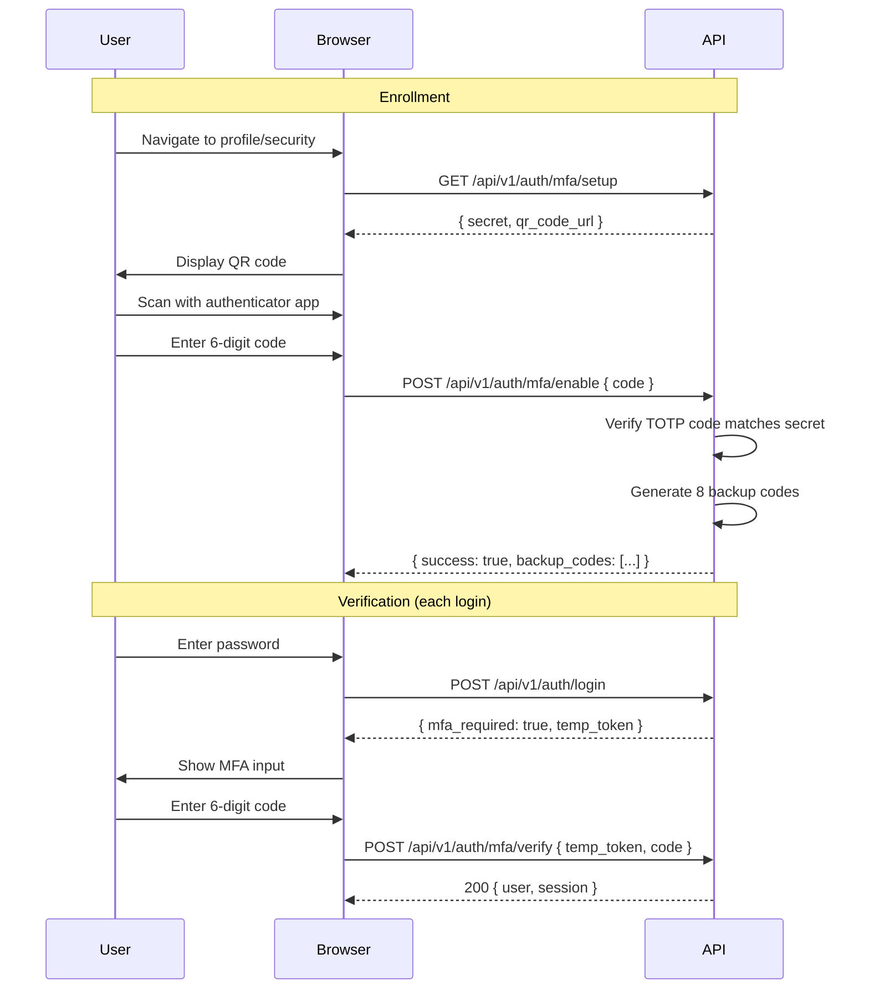
```mermaid
sequenceDiagram
    participant User
    participant Browser
    participant API

    Note over User,API: Enrollment
    User->>Browser: Navigate to profile/security
    Browser->>API: GET /api/v1/auth/mfa/setup
    API-->>Browser: { secret, qr_code_url }
    Browser->>User: Display QR code
    User->>Browser: Scan with authenticator app
    User->>Browser: Enter 6-digit code
    Browser->>API: POST /api/v1/auth/mfa/enable { code }
    API->>API: Verify TOTP code matches secret
    API->>API: Generate 8 backup codes
    API-->>Browser: { success: true, backup_codes: [...] }

    Note over User,API: Verification (each login)
    User->>Browser: Enter password
    Browser->>API: POST /api/v1/auth/login
    API-->>Browser: { mfa_required: true, temp_token }
    Browser->>User: Show MFA input
    User->>Browser: Enter 6-digit code
    Browser->>API: POST /api/v1/auth/mfa/verify { temp_token, code }
    API-->>Browser: 200 { user, session }
```

### 7.4 Password Policy

| Requirement             | Value                                           |
| ----------------------- | ----------------------------------------------- |
| Minimum length          | 12 characters                                   |
| Required classes        | Uppercase + lowercase + digit + symbol          |
| Maximum age             | 90 days (configurable)                          |
| History                 | Last 5 passwords blocked                        |
| Hashing algorithm       | Argon2id (memory 64MB, 3 iterations, 4 threads) |
| Failed attempts lockout | 5 → 15-minute lock                              |

---

## 8. Authorization Flow

### 8.1 Permission Check Flow

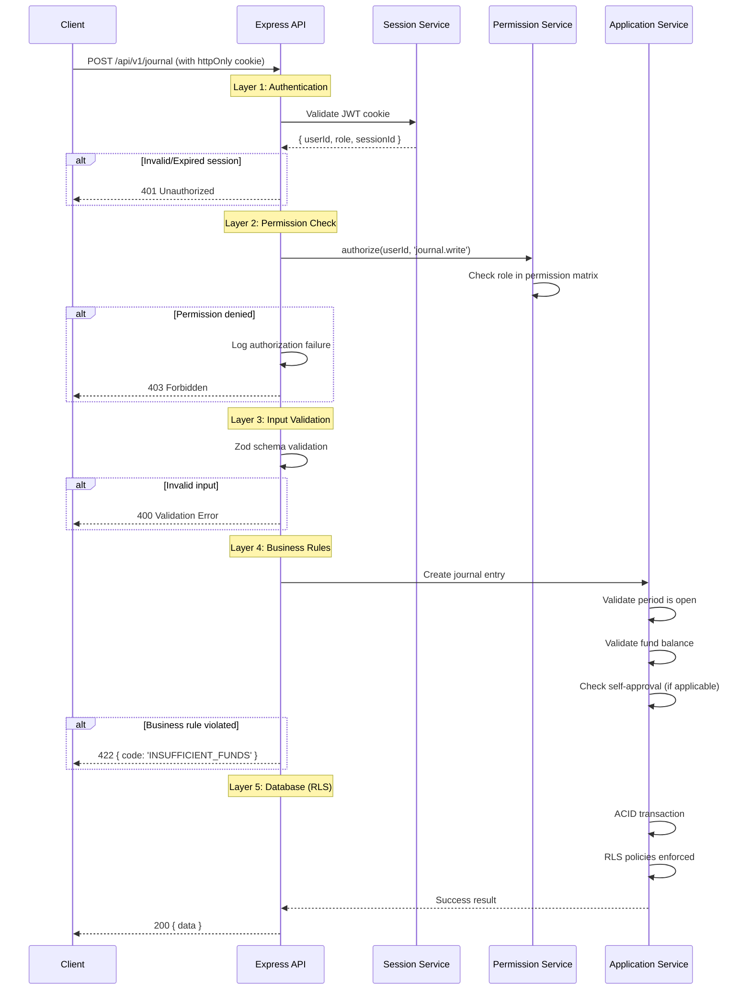
```mermaid
sequenceDiagram
    participant Client
    participant API as Express API
    participant Session as Session Service
    participant Perm as Permission Service
    participant Service as Application Service

    Client->>API: POST /api/v1/journal (with httpOnly cookie)

    Note over API: Layer 1: Authentication
    API->>Session: Validate JWT cookie
    Session-->>API: { userId, role, sessionId }
    alt Invalid/Expired session
        API-->>Client: 401 Unauthorized
    end

    Note over API: Layer 2: Permission Check
    API->>Perm: authorize(userId, 'journal.write')
    Perm->>Perm: Check role in permission matrix
    alt Permission denied
        API->>API: Log authorization failure
        API-->>Client: 403 Forbidden
    end

    Note over API: Layer 3: Input Validation
    API->>API: Zod schema validation
    alt Invalid input
        API-->>Client: 400 Validation Error
    end

    Note over API: Layer 4: Business Rules
    API->>Service: Create journal entry
    Service->>Service: Validate period is open
    Service->>Service: Validate fund balance
    Service->>Service: Check self-approval (if applicable)
    alt Business rule violated
        API-->>Client: 422 { code: 'INSUFFICIENT_FUNDS' }
    end

    Note over API: Layer 5: Database (RLS)
    Service->>Service: ACID transaction
    Service->>Service: RLS policies enforced
    Service-->>API: Success result
    API-->>Client: 200 { data }
```

### 8.2 Role-Permission Matrix

| Permission        | super_admin | pastor | treasurer | finance_staff | auditor | viewer |
| ----------------- | :---------: | :----: | :-------: | :-----------: | :-----: | :----: |
| `journal.write`   |     ✅      |   ❌   |    ✅     |      ✅       |   ❌    |   ❌   |
| `journal.approve` |     ✅      |   ✅   |    ❌     |      ❌       |   ❌    |   ❌   |
| `journal.void`    |     ✅      |   ✅   |    ❌     |      ❌       |   ❌    |   ❌   |
| `journal.read`    |     ✅      |   ✅   |    ✅     |      ✅       |   ✅    |   ✅   |
| `fund.create`     |     ✅      |   ❌   |    ✅     |      ❌       |   ❌    |   ❌   |
| `fund.transfer`   |     ✅      |   ❌   |    ✅     |      ❌       |   ❌    |   ❌   |
| `period.close`    |     ✅      |   ❌   |    ✅     |      ❌       |   ❌    |   ❌   |
| `period.reopen`   |     ✅      |   ❌   |    ❌     |      ❌       |   ✅    |   ❌   |
| `audit.read`      |     ✅      |   ✅   |    ❌     |      ❌       |   ✅    |   ❌   |
| `settings.write`  |     ✅      |   ❌   |    ❌     |      ❌       |   ❌    |   ❌   |
| `user.create`     |     ✅      |   ❌   |    ❌     |      ❌       |   ❌    |   ❌   |
| Total             |     40      |   20   |    17     |      10       |    9    |   6    |

### 8.3 Approval Thresholds

| Amount Tier      | Required Approvers   | Max Authorization      |
| ---------------- | -------------------- | ---------------------- |
| < ฿5,000         | Treasurer or Pastor  | Single approval        |
| ฿5,000 – ฿50,000 | Pastor               | Single approval        |
| > ฿50,000        | Pastor + Super Admin | Dual approval required |

### 8.4 Critical Security Rules

| Rule                              | Enforcement                                            |
| --------------------------------- | ------------------------------------------------------ |
| **No self-approval**              | `createdBy !== approvedBy` always enforced server-side |
| **No delete of approved entries** | Must void (creates reversing entry)                    |
| **Separation of duties**          | Creator ≠ Approver; Counter 1 ≠ Counter 2              |
| **Audit log is append-only**      | INSERT-only permissions on audit_log table             |
| **RLS at database level**         | Even if app layer bypassed, DB enforces access         |

---

## 9. Database Architecture

### 9.1 Entity Relationship Diagram

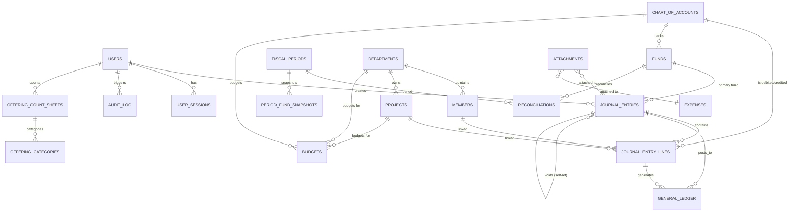
```mermaid
erDiagram
    USERS ||--o{ JOURNAL_ENTRIES : creates
    USERS ||--o{ USER_SESSIONS : has
    USERS ||--o{ AUDIT_LOG : triggers
    USERS ||--o{ OFFERING_COUNT_SHEETS : counts

    CHART_OF_ACCOUNTS ||--o{ JOURNAL_ENTRY_LINES : "is debited/credited"
    CHART_OF_ACCOUNTS ||--o{ FUNDS : "backs"
    CHART_OF_ACCOUNTS ||--o{ BUDGETS : budgets

    JOURNAL_ENTRIES ||--o{ JOURNAL_ENTRY_LINES : contains
    JOURNAL_ENTRIES ||--o{ GENERAL_LEDGER : posts_to
    JOURNAL_ENTRIES }o--|| JOURNAL_ENTRIES : "voids (self-ref)"

    JOURNAL_ENTRY_LINES ||--o{ GENERAL_LEDGER : generates

    FUNDS ||--o{ JOURNAL_ENTRIES : "primary fund"
    FUNDS ||--o{ RECONCILIATIONS : reconciles

    FISCAL_PERIODS ||--o{ RECONCILIATIONS : "period"
    FISCAL_PERIODS ||--o{ PERIOD_FUND_SNAPSHOTS : snapshots

    MEMBERS ||--o{ JOURNAL_ENTRY_LINES : "linked"

    DEPARTMENTS ||--o{ MEMBERS : contains
    DEPARTMENTS ||--o{ PROJECTS : "owns"
    DEPARTMENTS ||--o{ BUDGETS : "budgets for"

    PROJECTS ||--o{ JOURNAL_ENTRY_LINES : "linked"
    PROJECTS ||--o{ BUDGETS : "budgets for"

    OFFERING_COUNT_SHEETS ||--o{ OFFERING_CATEGORIES : "categories"

    ATTACHMENTS }o--|| JOURNAL_ENTRIES : "attached to"
    ATTACHMENTS }o--|| EXPENSES : "attached to"
```

### 9.2 Core Tables

| Table                   | Purpose                           | Key Constraints                                             |
| ----------------------- | --------------------------------- | ----------------------------------------------------------- |
| `chart_of_accounts`     | Account definitions               | `account_code` UNIQUE; CHECK account_type                   |
| `journal_entries`       | Debit/credit entries              | CHECK (total_debit = total_credit); CHECK (total_debit > 0) |
| `journal_entry_lines`   | Individual line items             | CHECK (amount > 0); FK to journal_entries                   |
| `general_ledger`        | Running balances per account+fund | UNIQUE per line; running_balance stored                     |
| `funds`                 | Fund definitions and balances     | FK to chart_of_accounts; current_balance stored             |
| `fiscal_periods`        | Accounting periods                | UNIQUE(year, period); status CHECK                          |
| `reconciliations`       | Period reconciliation records     | UNIQUE(period_id, fund_id)                                  |
| `offerings`             | Offering records                  | FK to journal_entry; channel CHECK                          |
| `offering_count_sheets` | Sunday count verification         | counter_1_id ≠ counter_2_id                                 |
| `expenses`              | Expense records                   | FK to journal_entry                                         |
| `budgets`               | Budget allocations                | FK to chart_of_accounts; period_type CHECK                  |
| `members`               | Church member directory           | PII columns; consent tracking                               |
| `departments`           | Church organizational units       | —                                                           |
| `projects`              | Project tracking                  | status CHECK                                                |
| `users`                 | System users                      | role CHECK                                                  |
| `user_sessions`         | Active sessions                   | FK to users; expires_at                                     |
| `audit_log`             | Immutable audit trail             | hash chain; INSERT-only                                     |
| `attachments`           | File metadata                     | FK to entities; storage_path                                |
| `app_settings`          | Singleton system settings         | Single row; church_name required                            |

### 9.3 Indexing Strategy

```sql
-- Performance-critical indexes

-- Journal entries: most queried by date, status, fund
CREATE INDEX idx_je_posting_date ON journal_entries(posting_date);
CREATE INDEX idx_je_status ON journal_entries(status);
CREATE INDEX idx_je_fund ON journal_entries(fund_id);
CREATE INDEX idx_je_fiscal ON journal_entries(fiscal_year, fiscal_period);
CREATE INDEX idx_je_type ON journal_entries(entry_type);

-- General ledger: queried by account, fund, date range
CREATE INDEX idx_gl_account_date ON general_ledger(account_id, posting_date);
CREATE INDEX idx_gl_fund_date ON general_ledger(fund_id, posting_date);
CREATE INDEX idx_gl_fiscal ON general_ledger(fiscal_year, fiscal_period);

-- Audit: queried by entity, user, date
CREATE INDEX idx_audit_entity ON audit_log(entity_type, entity_id);
CREATE INDEX idx_audit_user ON audit_log(user_id);
CREATE INDEX idx_audit_date ON audit_log(created_at);
CREATE INDEX idx_audit_event ON audit_log(event_type);

-- Offerings: queried by date, member
CREATE INDEX idx_offerings_date ON offerings(date);
CREATE INDEX idx_offerings_member ON offerings(member_id);

-- Financial reports: pre-aggregated for periods
-- Materialized view for balance sheet queries
CREATE MATERIALIZED VIEW mv_trial_balance AS
SELECT account_id, fund_id, fiscal_year, fiscal_period,
       SUM(debit_amount) as total_debits,
       SUM(credit_amount) as total_credits
FROM general_ledger
GROUP BY account_id, fund_id, fiscal_year, fiscal_period;
```

### 9.4 Data Integrity Constraints

```sql
-- Core accounting integrity
ALTER TABLE journal_entries ADD CONSTRAINT chk_balanced
    CHECK (total_debit = total_credit);
ALTER TABLE journal_entries ADD CONSTRAINT chk_positive_amounts
    CHECK (total_debit > 0 AND total_credit > 0);

-- Fiscal periods
ALTER TABLE fiscal_periods ADD CONSTRAINT chk_period_status
    CHECK (status IN ('open', 'closed', 'reconciled'));

-- Offering count sheets
ALTER TABLE offering_count_sheets ADD CONSTRAINT chk_different_counters
    CHECK (counter_1_id <> counter_2_id);
ALTER TABLE offering_count_sheets ADD CONSTRAINT chk_counter_3_distinct
    CHECK (counter_3_id IS NULL OR
           (counter_3_id <> counter_1_id AND counter_3_id <> counter_2_id));
ALTER TABLE offering_count_sheets ADD CONSTRAINT chk_count_sheet_status
    CHECK (status IN ('counting', 'in_review', 'reconciled', 'locked'));

-- Sequential entry numbers
ALTER TABLE journal_entries ADD CONSTRAINT uq_entry_number
    UNIQUE (entry_number);
```

---

## 10. Storage Architecture

### 10.1 Storage Provider

**Decision:** Supabase Storage (S3-compatible)

| Reason                    | Detail                                   |
| ------------------------- | ---------------------------------------- |
| Same provider as database | Reduced integration complexity           |
| S3-compatible             | Can migrate to any S3 provider later     |
| RLS integration           | Storage policies align with database RLS |
| Signed URLs               | Time-limited access for secure downloads |
| Image transformations     | Built-in resizing for thumbnails         |

### 10.2 Storage Structure

```
attachments/
├── receipts/                    # Expense/income receipts
│   ├── {church_id}/
│   │   ├── {entity_type}/
│   │   │   └── {entity_id}/
│   │   │       ├── {uuid}-original.pdf
│   │   │       └── {uuid}-thumbnail.jpg
│   │   └── ...
├── count-sheets/                # Sunday count sheet photos
│   └── {church_id}/
│       └── {date}/
│           └── {uuid}.jpg
└── exports/                     # Generated reports
    └── {church_id}/
        └── {report_type}/
            └── {date}-{uuid}.pdf
```

### 10.3 File Upload Flow

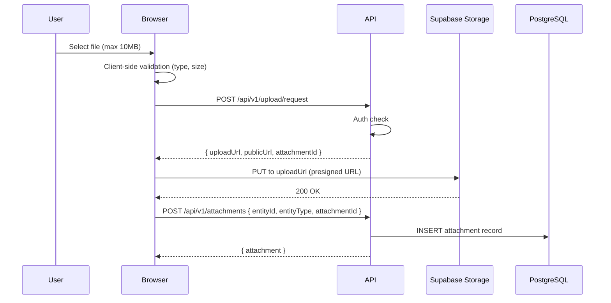
```mermaid
sequenceDiagram
    participant User
    participant Browser
    participant API
    participant Storage as Supabase Storage
    participant DB as PostgreSQL

    User->>Browser: Select file (max 10MB)
    Browser->>Browser: Client-side validation (type, size)
    Browser->>API: POST /api/v1/upload/request
    API->>API: Auth check
    API-->>Browser: { uploadUrl, publicUrl, attachmentId }

    Browser->>Storage: PUT to uploadUrl (presigned URL)
    Storage-->>Browser: 200 OK

    Browser->>API: POST /api/v1/attachments { entityId, entityType, attachmentId }
    API->>DB: INSERT attachment record
    API-->>Browser: { attachment }
```

### 10.4 Attachment Security

| Control            | Implementation                              |
| ------------------ | ------------------------------------------- |
| Max file size      | 10MB (enforced server-side and client-side) |
| Allowed types      | PDF, JPG, PNG, HEIC                         |
| Storage isolation  | Per-church folder structure                 |
| Access control     | Signed URLs with 1-hour expiry              |
| Virus scanning     | (Future) — ClamAV integration               |
| Encryption at rest | Supabase-managed AES-256                    |

### 10.5 Migration from Base64

**Current state:** Attachments stored as base64 strings in the database (severely impacts database performance, storage cost, and backup size).

**Target state:** Files stored in object storage; database stores only metadata.

**Migration strategy:**

1. Create `attachments` table and storage bucket
2. For each existing entity with `attachment_url` base64:
   - Decode base64 → write to storage → record metadata
   - Update reference to new storage path
3. Once migrated, remove base64 column
4. Implement new upload flow using presigned URLs

---

## 11. Integration Architecture

### 11.1 Integration Map

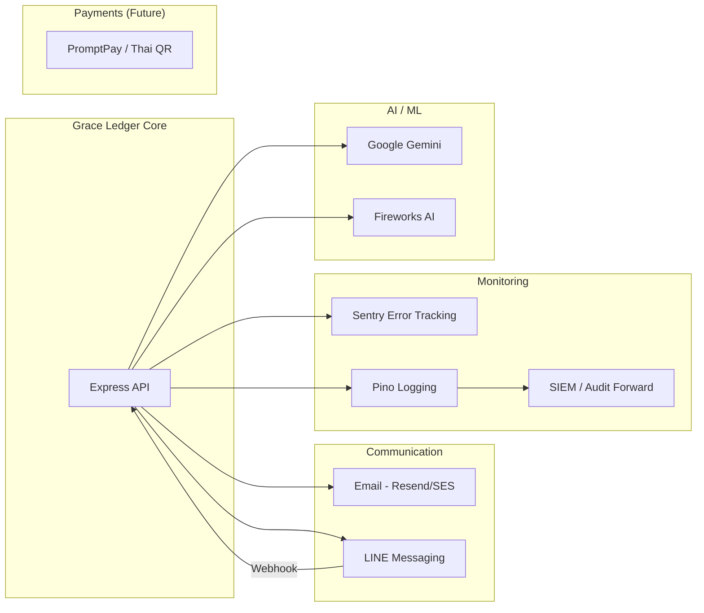
```mermaid
graph LR
    subgraph "Grace Ledger Core"
        API[Express API]
    end

    subgraph "Communication"
        EMAIL[Email - Resend/SES]
        LINE[LINE Messaging]
    end

    subgraph "Monitoring"
        SENTRY[Sentry Error Tracking]
        LOG[Pino Logging]
        SIEM[SIEM / Audit Forward]
    end

    subgraph "AI / ML"
        GEMINI[Google Gemini]
        FW[Fireworks AI]
    end

    subgraph "Payments (Future)"
        PAY[PromptPay / Thai QR]
    end

    API --> EMAIL
    API --> LINE
    API --> GEMINI
    API --> FW

    API --> SENTRY
    API --> LOG

    LOG --> SIEM

    LINE -- Webhook --> API
```

### 11.2 Integration Details

| Integration        | Direction       | Protocol           | Purpose                                | Priority |
| ------------------ | --------------- | ------------------ | -------------------------------------- | -------- |
| Supabase Auth      | Bidirectional   | REST SDK           | Authentication, session management     | P0       |
| Supabase Storage   | API → Supabase  | REST SDK           | File attachments, exports              | P0       |
| Sentry             | API → Sentry    | SDK                | Error tracking, performance monitoring | P0       |
| LINE Messaging     | Bidirectional   | Webhook + REST     | Offering notifications, member updates | P1       |
| Google Gemini      | API → Gemini    | REST (server-side) | Receipt OCR, voucher analysis          | P1       |
| Fireworks AI       | API → Fireworks | REST (server-side) | AI features                            | P1       |
| Email (Resend/SES) | API → Email     | REST               | Notifications, statements              | P1       |
| SIEM Forward       | API → SIEM      | Syslog/HTTP        | Audit log export                       | P2       |

### 11.3 LINE Integration Architecture

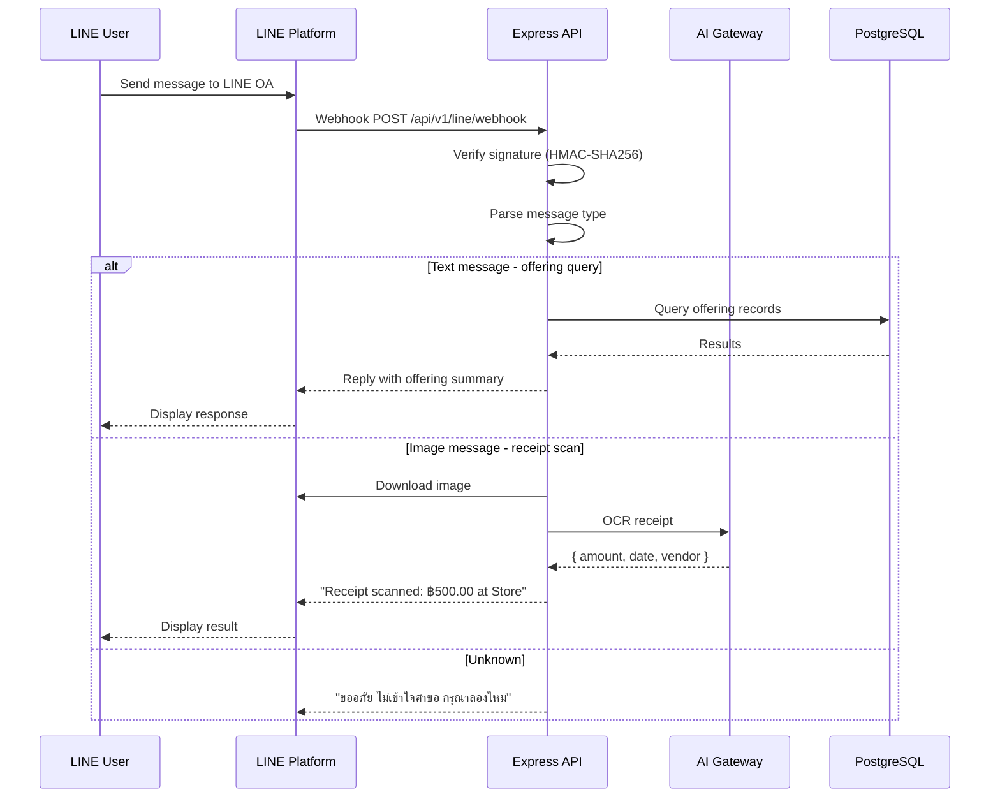
```mermaid
sequenceDiagram
    participant User as LINE User
    participant LINE as LINE Platform
    participant API as Express API
    participant AIService as AI Gateway
    participant DB as PostgreSQL

    User->>LINE: Send message to LINE OA
    LINE->>API: Webhook POST /api/v1/line/webhook

    API->>API: Verify signature (HMAC-SHA256)
    API->>API: Parse message type

    alt Text message - offering query
        API->>DB: Query offering records
        DB-->>API: Results
        API-->>LINE: Reply with offering summary
        LINE-->>User: Display response
    else Image message - receipt scan
        API->>LINE: Download image
        API->>AIService: OCR receipt
        AIService-->>API: { amount, date, vendor }
        API-->>LINE: "Receipt scanned: ฿500.00 at Store"
        LINE-->>User: Display result
    else Unknown
        API-->>LINE: "ขออภัย ไม่เข้าใจคำขอ กรุณาลองใหม่"
    end
```

---

## 12. Deployment Architecture

### 12.1 Environment Strategy

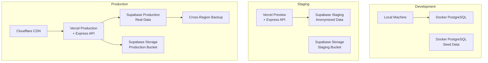
```mermaid
graph TB
    subgraph "Development"
        DEV_LOCAL[Local Machine]
        DEV_DB[Docker PostgreSQL]
        DEV_DEV_DB[Docker PostgreSQL<br/>Seed Data]
    end

    subgraph "Staging"
        STG[Vercel Preview<br/>+ Express API]
        STG_DB[Supabase Staging<br/>Anonymized Data]
        STG_STORAGE[Supabase Storage<br/>Staging Bucket]
    end

    subgraph "Production"
        PRD_CDN[Cloudflare CDN]
        PRD_APP[Vercel Production<br/>+ Express API]
        PRD_DB[Supabase Production<br/>Real Data]
        PRD_STORAGE[Supabase Storage<br/>Production Bucket]
        PRD_BACKUP[Cross-Region Backup]
    end

    DEV_LOCAL --> DEV_DB
    STG --> STG_DB
    PRD_CDN --> PRD_APP
    PRD_APP --> PRD_DB
    PRD_APP --> PRD_STORAGE
    PRD_DB --> PRD_BACKUP
```

### 12.2 CI/CD Pipeline

```mermaid
graph LR
    subgraph "GitHub Actions"
        LINT[Lint & Type Check]
        TEST[Run Tests]
        BUILD[Build]
        MIGRATE[Run Migrations]
        DEPLOY[Deploy]
    end

    subgraph "Quality Gates"
        Q1[TypeScript Strict]
        Q2[All Tests Pass]
        Q3[Security Scan]
        Q4[Build Succeeds]
    end

    PR[Pull Request] --> LINT
    LINT --> Q1
    Q1 --> TEST
    TEST --> Q2
    Q2 --> BUILD
    BUILD --> Q3
    Q3 --> BUILD
    Q3 --> MIGRATE
    MIGRATE --> Q4
    Q4 --> DEPLOY
    DEPLOY --> STAGING[Staging]
    DEPLOY --> PRODUCTION[Production<br/>(Manual Approve)]
```

### 12.3 Infrastructure Requirements

| Resource   | Specification                | Justification                |
| ---------- | ---------------------------- | ---------------------------- |
| Web server | 2 vCPU, 4GB RAM              | SSR + API handling           |
| Database   | Supabase Pro (8GB, 10M rows) | Financial data + audit trail |
| Storage    | Supabase Pro (100GB)         | Receipts, exports            |
| CDN        | Cloudflare (Free tier)       | Static assets, caching       |
| Monitoring | Sentry (Team tier)           | Error tracking, performance  |
| CI/CD      | GitHub Actions (Free)        | Build, test, deploy          |

### 12.4 Secrets Management

| Secret                      | Location              | Access               |
| --------------------------- | --------------------- | -------------------- |
| `SUPABASE_URL`              | Vercel/Server env     | Server-side only     |
| `SUPABASE_SERVICE_ROLE_KEY` | Vercel/Server env     | Server-side only     |
| `JWT_SECRET`                | Vercel/Server env     | Server-side only     |
| `GEMINI_API_KEY`            | Server env            | Server-side only     |
| `FIREWORKS_API_KEY`         | Server env            | Server-side only     |
| `SENTRY_DSN`                | Vite env + Server env | Public (Sentry-safe) |
| `RESEND_API_KEY`            | Server env            | Server-side only     |
| `LINE_CHANNEL_SECRET`       | Server env            | Server-side only     |

---

## 13. Monitoring Architecture

### 13.1 Observability Stack

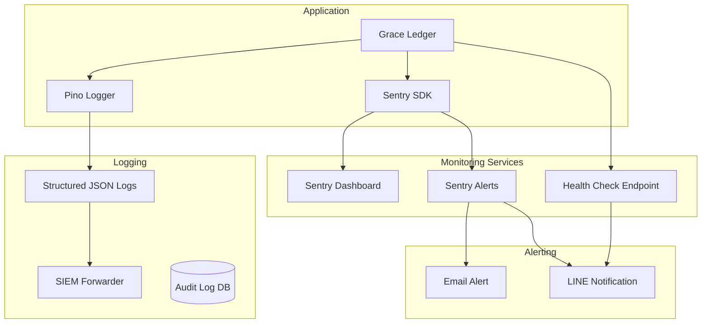
```mermaid
graph TB
    subgraph "Application"
        APP[Grace Ledger]
        PINO[Pino Logger]
        SENTRY[Sentry SDK]
    end

    subgraph "Monitoring Services"
        SENTRY_DASH[Sentry Dashboard]
        SENTRY_ALERT[Sentry Alerts]
        HEALTH[Health Check Endpoint]
    end

    subgraph "Alerting"
        EMAIL_ALERT[Email Alert]
        LINE_ALERT[LINE Notification]
    end

    subgraph "Logging"
        PINO_OUT[Structured JSON Logs]
        SIEM_FWD[SIEM Forwarder]
        AUDIT_DB[(Audit Log DB)]
    end

    APP --> PINO
    APP --> SENTRY
    APP --> HEALTH

    PINO --> PINO_OUT
    PINO_OUT --> SIEM_FWD
    SENTRY --> SENTRY_DASH
    SENTRY --> SENTRY_ALERT

    SENTRY_ALERT --> EMAIL_ALERT
    SENTRY_ALERT --> LINE_ALERT
    HEALTH --> LINE_ALERT
```

### 13.2 Key Metrics

| Metric                  | Source                 | Collection         | Alert Threshold                     | Severity    |
| ----------------------- | ---------------------- | ------------------ | ----------------------------------- | ----------- |
| API p95 latency         | Express middleware     | Per-request        | > 2s                                | 🔴 Critical |
| Database query p95      | Drizzle                | Per-query          | > 500ms                             | 🟡 Warning  |
| Error rate              | Sentry                 | Per-minute         | > 1%                                | 🔴 Critical |
| 5xx status count        | Express middleware     | Per-minute         | > 0 (financial endpoints)           | 🔴 Critical |
| Failed logins / min     | Auth service           | Per-minute         | > 10/min                            | 🟠 High     |
| Fund overdraft events   | Fund service           | Real-time          | Any occurrence                      | 🔴 Critical |
| Reconciliation mismatch | Reconciliation service | Per-reconciliation | Variance > ฿100 without explanation | 🟠 High     |
| Backup status           | Supabase               | Daily              | Failed backup                       | 🔴 Critical |
| PITR lag                | Supabase               | Hourly             | > 1 hour                            | 🟡 Warning  |
| AI service cost         | AI gateway             | Daily              | > 80% of monthly budget             | 🟡 Warning  |
| Active sessions         | Session service        | Hourly             | Anomalous spike                     | 🟡 Warning  |

### 13.3 Health Check Endpoint

```typescript
// GET /api/v1/health
{
  "status": "healthy",
  "version": "2.0.0",
  "uptime": 1234567,
  "checks": {
    "database": { "status": "ok", "responseTimeMs": 5 },
    "storage": { "status": "ok", "responseTimeMs": 12 },
    "migrations": { "status": "ok", "current": "0023_latest" },
    "ai_gateway": { "status": "ok", "dailyUsage": 142 }
  },
  "timestamp": "2026-07-29T10:00:00Z"
}
```

### 13.4 Audit Log Forwarding

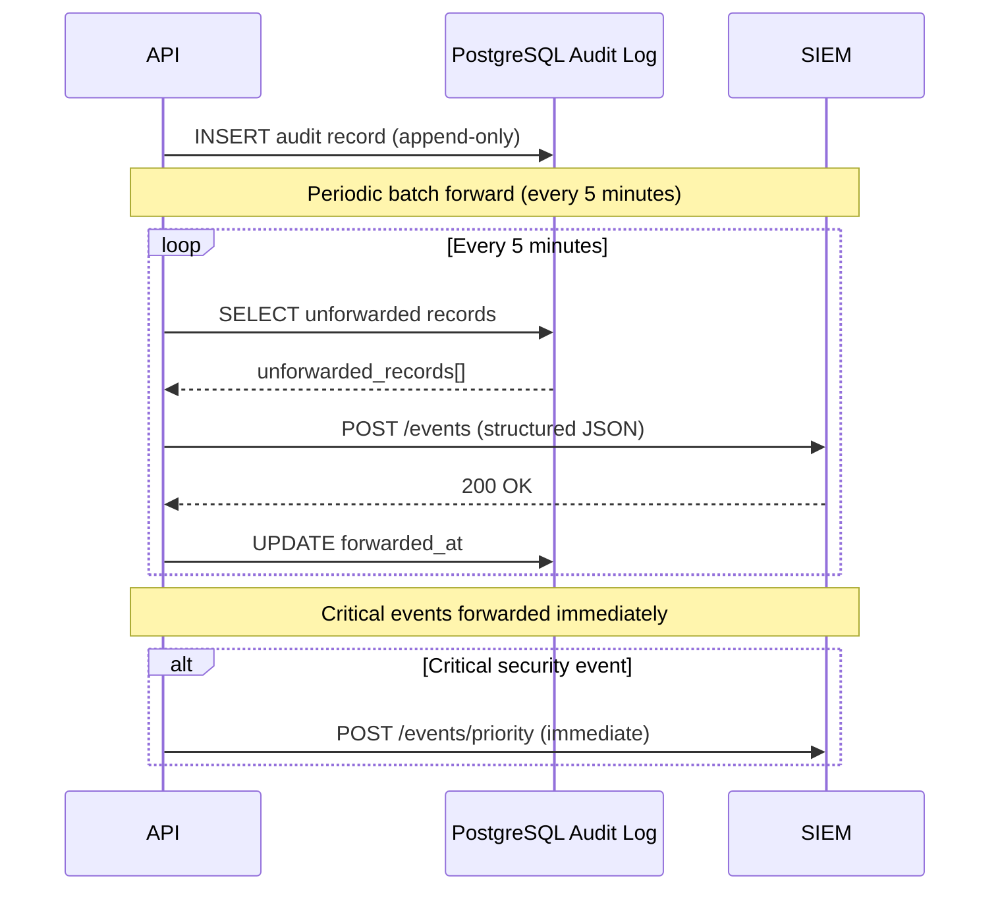
```mermaid
sequenceDiagram
    participant API
    participant AuditDB as PostgreSQL Audit Log
    participant SIEM

    API->>AuditDB: INSERT audit record (append-only)

    Note over API,SIEM: Periodic batch forward (every 5 minutes)
    loop Every 5 minutes
        API->>AuditDB: SELECT unforwarded records
        AuditDB-->>API: unforwarded_records[]
        API->>SIEM: POST /events (structured JSON)
        SIEM-->>API: 200 OK
        API->>AuditDB: UPDATE forwarded_at
    end

    Note over API,SIEM: Critical events forwarded immediately
    alt Critical security event
        API->>SIEM: POST /events/priority (immediate)
    end
```

---

## 14. Disaster Recovery Architecture

### 14.1 Backup Strategy

| Backup Type          | Frequency  | Retention | Storage                    | Recovery Point     |
| -------------------- | ---------- | --------- | -------------------------- | ------------------ |
| Full database dump   | Daily      | 30 days   | Supabase + S3              | 24 hours max       |
| WAL archiving (PITR) | Continuous | 7 days    | Supabase managed           | 5 minutes          |
| Cross-region backup  | Weekly     | 90 days   | Secondary Supabase project | 7 days max         |
| Annual archive       | Yearly     | 7+ years  | Cold storage (S3 Glacier)  | Year-end snapshots |

### 14.2 Recovery Scenarios

| Scenario                     | RTO        | RPO               | Procedure                                    |
| ---------------------------- | ---------- | ----------------- | -------------------------------------------- |
| Accidental data deletion     | 1 hour     | 5 minutes         | PITR to point before deletion                |
| Database corruption          | 4 hours    | 24 hours          | Restore from latest full backup + WAL        |
| Application misconfiguration | 30 minutes | 0 (config in Git) | Rollback to previous deployment              |
| Cloud provider outage        | 4 hours    | 1 hour            | Failover to backup project                   |
| Security breach              | 1 hour     | 5 minutes         | Isolate, snapshot, restore from clean backup |
| Ransomware                   | 4 hours    | 24 hours          | Restore from immutable backup                |
| Full data center loss        | 8 hours    | 24 hours          | Restore from cross-region backup             |

### 14.3 Recovery Flow

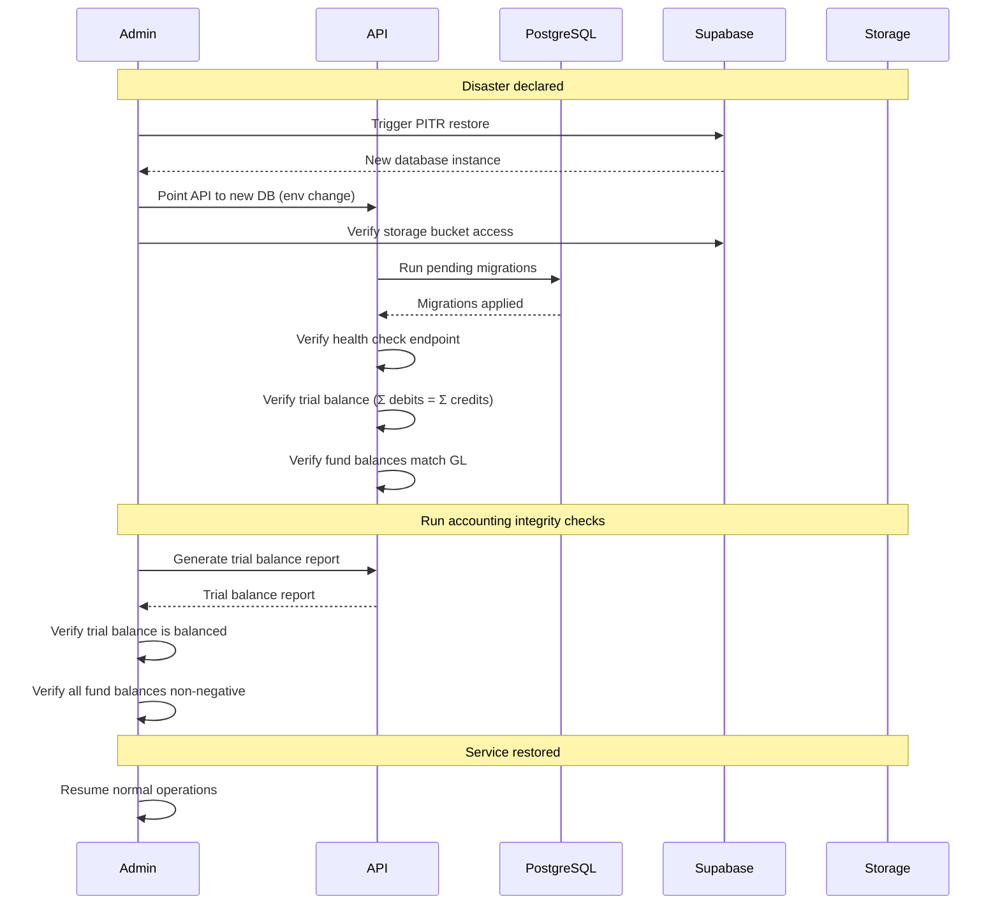
```mermaid
sequenceDiagram
    participant Admin
    participant API
    participant DB as PostgreSQL
    participant Supabase
    participant Storage

    Note over Admin,Storage: Disaster declared

    Admin->>Supabase: Trigger PITR restore
    Supabase-->>Admin: New database instance

    Admin->>API: Point API to new DB (env change)
    Admin->>Supabase: Verify storage bucket access

    API->>DB: Run pending migrations
    DB-->>API: Migrations applied

    API->>API: Verify health check endpoint
    API->>API: Verify trial balance (Σ debits = Σ credits)
    API->>API: Verify fund balances match GL

    Note over Admin,Storage: Run accounting integrity checks
    Admin->>API: Generate trial balance report
    API-->>Admin: Trial balance report
    Admin->>Admin: Verify trial balance is balanced
    Admin->>Admin: Verify all fund balances non-negative

    Note over Admin,Storage: Service restored
    Admin->>Admin: Resume normal operations
```

### 14.4 Data Retention and Archival

| Data Type        | Active Retention                    | Archive Policy           | Deletion Policy         |
| ---------------- | ----------------------------------- | ------------------------ | ----------------------- |
| Journal entries  | Online (unlimited)                  | Never deleted            | N/A                     |
| General ledger   | Online (unlimited)                  | Partition by fiscal year | N/A                     |
| Audit log        | Online (current + 1 year)           | PostgreSQL partitioning  | Never deleted           |
| Offering records | Online (unlimited)                  | —                        | N/A                     |
| Member PII       | Active + 7 years after deactivation | Anonymize after 7 years  | Right to erasure (PDPA) |
| User accounts    | Active + 1 year after deactivation  | Soft-delete              | Never hard-deleted      |
| Attachments      | Online (unlimited)                  | —                        | Never deleted           |
| Session records  | Active + 30 days                    | Purge after 30 days      | Automatic               |

### 14.5 Business Continuity

| Timeframe   | Action                                                |
| ----------- | ----------------------------------------------------- |
| 0-1 hour    | Detect outage, declare incident, begin recovery       |
| 1-4 hours   | Restore database, verify integrity, resume operations |
| 4-24 hours  | Full investigation, root cause analysis               |
| 24-48 hours | Implement preventive measures, update documentation   |
| 1 week      | Post-mortem, update DR plan                           |

---

## Summary of Key Architectural Decisions

| Decision          | Choice                          | Key Reason                                      |
| ----------------- | ------------------------------- | ----------------------------------------------- |
| API architecture  | Express server + TanStack Start | Separation of concerns; independent scaling     |
| Database          | PostgreSQL 16 (Supabase)        | ACID transactions; RLS; PITR                    |
| ORM               | Drizzle                         | Type-safe; SQL-like; better for complex queries |
| Accounting model  | Double-entry journal            | Audit compliance; financial integrity           |
| Fund balance      | Stored in GL (not computed)     | Performance; audit trail                        |
| Authentication    | JWT in httpOnly cookies         | XSS protection; CSRF protection                 |
| Authorization     | RBAC with permission matrix     | Principle of least privilege                    |
| Attachments       | Supabase Storage (not DB)       | Performance; cost; scalability                  |
| AI calls          | Server-side proxy only          | API key security; cost control; audit           |
| Audit trail       | Immutable table with hash chain | Non-repudiation; regulatory compliance          |
| Transaction state | Finite state machine            | Enforced transitions; no invalid states         |
| Frontend state    | TanStack Query                  | Server state caching; optimistic updates        |

---

_This document defines the target architecture for Grace Ledger. All implementation work should align with these decisions. Deviations require architecture review and an accompanying ADR._
