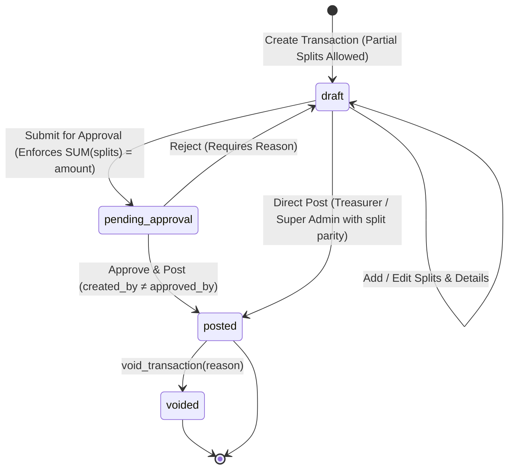

# MILESTONE 2: CORE FINANCIAL WORKFLOWS — IMPLEMENTATION PLAN
**Project:** Grace Ledger  
**Milestone:** M2 — Core Financial Workflows  
**Date:** 2026-08-17  
**Status:** **PLANNING & DESIGN** (Phase 1: Transaction Core)  
**Foundation Base:** M1 Verified on Supabase PostgreSQL 17  

---

## 1. Executive Overview & Architecture

Milestone 2 transitions Grace Ledger from a verified database foundation to a fully operational financial workflow engine. All business workflows are built strictly following a bottom-up architectural hierarchy:

```text
       DATABASE LAYER        (PostgreSQL 17 Schema, Triggers, RLS, Foreign Keys)
             ↓
        DOMAIN LAYER         (Money precision, Split validation, RBAC Rules)
             ↓
    BUSINESS WORKFLOW LAYER  (State Machine: Draft → Submit → Approve → Post → Void)
             ↓
      API / RPC LAYER        (SECURITY DEFINER RPCs, Server-Side Authorization)
             ↓
        UI LAYER             (Mobile OS Design System, 18 Mockup-Aligned Screens)
             ↓
     E2E TESTING SUITE       (Automated User Journeys, Multi-Role Audit)
```

---

## 2. Phased Implementation Roadmap

To avoid structural regressions and maintain 100% financial correctness, M2 is partitioned into focused phases:

```text
┌────────────────────────────────────────────────────────────────────────┐
│ M2 PHASE 1: TRANSACTION CORE (CURRENT FOCUS)                           │
│  - Transaction & Split Domain Models                                   │
│  - Draft Creation, Split Allocation & Parity Validation                │
│  - Account, Fund, Category Validation & Master Data Binding            │
│  - Transition to Pending Approval & Split Sum Parity Check             │
│  - Posting to Ledger & Immediate Balance Mutation                      │
│  - Void & Balancing Reversal Integration                               │
└────────────────────────────────────────────────────────────────────────┘
                                    ↓
┌────────────────────────────────────────────────────────────────────────┐
│ M2 PHASE 2: APPROVAL WORKFLOW & SEGREGATION OF DUTIES                  │
│  - Two-Person Rule (No self-approval: created_by ≠ approved_by)         │
│  - Role Gating: Approver, Treasurer, Pastor                            │
│  - Approval Queue, Decision Logging, and Rejection Handling            │
└────────────────────────────────────────────────────────────────────────┘
                                    ↓
┌────────────────────────────────────────────────────────────────────────┐
│ M2 PHASE 3: FINANCIAL QUERY & REPORTING LAYER                          │
│  - Immutable Ledger Queries (Account Balance, Fund Envelopes)          │
│  - Pending Approval Queue & Activity Feeds                             │
│  - Monthly Income / Expense Category Rollups                           │
└────────────────────────────────────────────────────────────────────────┘
                                    ↓
┌────────────────────────────────────────────────────────────────────────┐
│ M2 PHASE 4: UI WORKFLOW INTEGRATION (MOCKUP-DRIVEN)                    │
│  - Screen 03: Transaction Entry                                        │
│  - Screen 04: Split Allocation Editor                                  │
│  - Screen 05: Transaction Detail & Audit Timeline                      │
│  - Screen 06: Approval Queue                                           │
└────────────────────────────────────────────────────────────────────────┘
                                    ↓
┌────────────────────────────────────────────────────────────────────────┐
│ M2 PHASE 5: OFFERING WORKSPACE & CASH COUNT (DEFERRED)                 │
│  - Multi-counter envelope logging, denomination sheets                 │
└────────────────────────────────────────────────────────────────────────┘
```

---

## 3. Financial State Machine



### State Machine Transition Rules

| Initial State | Target State | Actor Role Allowed | Invariant / Validation Rule |
| :--- | :--- | :--- | :--- |
| `[None]` | `draft` | `finance_staff`, `treasurer`, `pastor`, `super_admin` | Valid account, non-empty description, amount > 0. Splits may be partial. |
| `draft` | `pending_approval` | `created_by` or `finance_staff` | **Strict Parity**: `SUM(splits) == transaction.amount`. Every split has `fund_id`. |
| `pending_approval` | `draft` (Rejected) | `approver`, `treasurer`, `pastor`, `super_admin` | Rejection note mandatory (`>= 5` chars). Reverts status to draft for editing. |
| `pending_approval` | `posted` | `approver`, `treasurer`, `pastor`, `super_admin` | **Two-Person Rule**: `approved_by ≠ created_by`. Split sum verified. Funds/accounts updated. |
| `draft` | `posted` (Direct) | `treasurer`, `super_admin` | `SUM(splits) == transaction.amount`. Immediate posting without intermediary queue. |
| `posted` | `voided` | `treasurer`, `super_admin` | Original transaction locked as `voided` (never deleted). Creates balancing reversal entry. |

---

## 4. Domain & RPC Specifications

### 4.1 New RPCs for M2 Workflows

To ensure zero business logic bypass from the client side, the following database RPCs will be created with `SECURITY DEFINER` and `SET search_path = public, pg_temp`:

1. `submit_transaction(p_transaction_id UUID) RETURNS JSONB`
   - Validates caller belongs to transaction's church.
   - Verifies `SUM(splits) = amount`.
   - Transitions status `draft` -> `pending_approval`.
   - Emits `APPROVAL` category audit log.

2. `approve_and_post_transaction(p_transaction_id UUID, p_note TEXT) RETURNS JSONB`
   - Validates caller has `approver` role.
   - **Enforces Segregation of Duties**: Throws `Forbidden` if `auth.uid() == created_by` (unless super_admin bypass configured).
   - Verifies split parity.
   - Transitions status to `posted`, sets `posted_at = now()`, `approved_by = auth.uid()`.
   - Updates account and fund balances atomically.
   - Emits `APPROVAL` and `FINANCIAL` audit logs.

3. `reject_transaction(p_transaction_id UUID, p_rejection_reason TEXT) RETURNS JSONB`
   - Validates caller has `approver` role.
   - Mandates rejection reason (`>= 5` chars).
   - Transitions status `pending_approval` -> `draft`.
   - Emits `APPROVAL` category audit log with rejection justification.

---

## 5. UI Screen Mapping (Grace Ledger Mobile OS Design System)

All frontend components will directly utilize the existing Grace Ledger Design System tokens, typography, and extracted mockup layouts:

| Mockup Screen | Component / View | Purpose & Domain Hook |
| :--- | :--- | :--- |
| **Screen 03** | `TransactionEntryView` | Header details, account picker, direction toggle (`income` / `expense`), base amount. |
| **Screen 04** | `SplitAllocationEditor` | Dynamic split rows, fund selector, category selector, live parity badge (`฿ remaining`). |
| **Screen 05** | `TransactionDetailView` | Timeline stepper (`Draft` → `Submitted` → `Approved` → `Posted`), audit metadata, void trigger. |
| **Screen 06** | `ApprovalQueueView` | Pending approvals feed for approvers, side-by-side split review, approve / reject modal. |
| **Screen 07** | `AccountFundRegisterView`| Ledger register showing posted entries, running balance, and fund allocations. |

---

## 6. Verification & Test Strategy

### Automated Test Matrix
1. **Domain Unit Tests (`tests/unit/`)**:
   - Transaction lifecycle state transitions (`transaction-lifecycle.test.ts`).
   - Split allocation math and remainder calculation (`split-allocation.test.ts`).
   - Two-person segregation of duties rules (`approval-rules.test.ts`).
2. **Database Integration Tests (`tests/integration/`)**:
   - `submit_transaction()` RPC parity check.
   - `approve_and_post_transaction()` self-approval denial.
   - `reject_transaction()` state reversion.
   - Ledger query accuracy against PostgreSQL 17.
3. **E2E Financial User Journeys**:
   - **Journey 1**: Finance Staff creates Draft -> Allocates Splits -> Submits for Approval.
   - **Journey 2**: Approver views Queue -> Attempts Self-Approval (Blocked) -> Different Approver Approves -> Ledger Posted.
   - **Journey 3**: Treasurer Voids Posted Transaction -> Reversal Created -> Ledger Rebalanced.

---

## 7. M2 Phase 1 Execution Plan

We will execute **Phase 1: Transaction Core** first:
1. Create Transaction Core Domain Layer (`src/lib/transactions/`):
   - `transaction-types.ts`
   - `split-engine.ts`
   - `lifecycle.ts`
2. Create Migration 005 for Approval RPCs (`submit_transaction`, `approve_and_post_transaction`, `reject_transaction`).
3. Deploy & Verify Migration 005 on Supabase test instance.
4. Implement Transaction & Split test suite.
5. Report progress before starting Phase 2.
