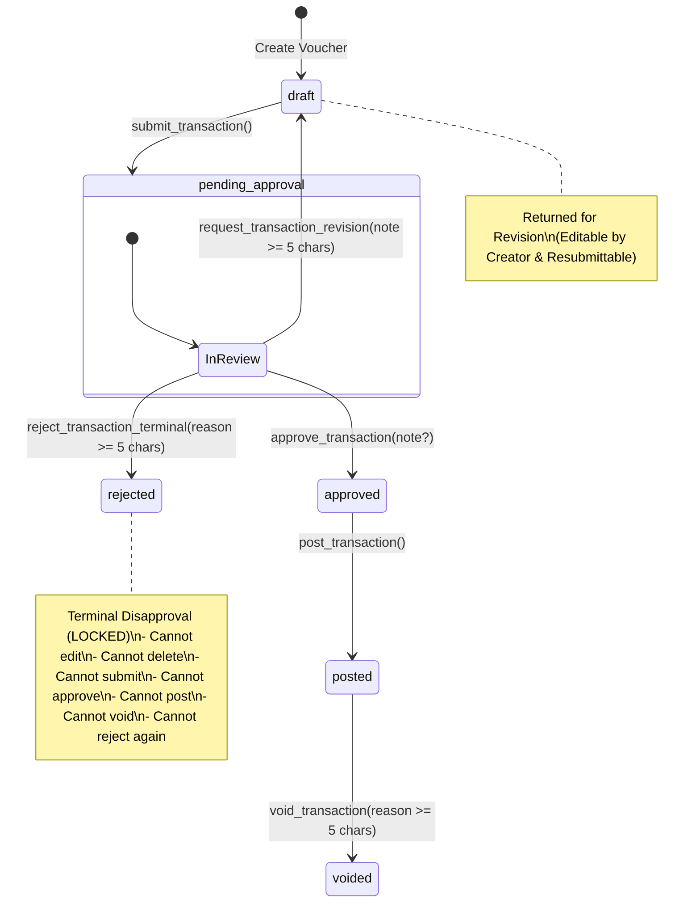

# Milestone 2 — Phase 2.1: Governance Semantics & Terminal Rejection Specification

**Project:** Grace Ledger  
**Milestone:** M2 — Core Financial Workflows  
**Sub-Phase:** Phase 2.1 — Governance Semantics Fix  
**Date:** 2026-08-18  
**Status:** **VERIFIED ON REAL SUPABASE POSTGRESQL 17 (11/11 TESTS PASS)**  

---

## 1. Executive Summary

In financial governance, a church ledger must differentiate between two fundamentally distinct review outcomes:
1. **"ขอแก้ไข" (Request Revision)**: A collaborative action returning a pending voucher to `draft` so the creator can attach missing invoices, adjust split categories, or correct line items before resubmission.
2. **"ปฏิเสธ" (Terminal Rejection)**: An authoritative leadership decision by an Elder, Pastor, or Finance Committee permanently disapproving an expenditure.

Under **Migration 006**, these actions are decoupled at the database level into distinct RPCs, separate audit actions, and enforced by strict lifecycle triggers guaranteeing that **`rejected` is an immutable, terminal governance record**.

---

## 2. State Machine & Lifecycle Transitions



### Transition Permission Matrix

| From State | To State | Initiator Role | Authorization / Guards | Target Status |
| :--- | :--- | :--- | :--- | :--- |
| `draft` | `pending_approval` | Creator / Staff | Split sum parity == Amount | `pending_approval` |
| `draft` | `posted` | Treasurer | Direct post with split parity | `posted` |
| `pending_approval` | `draft` | Approver / Pastor | Reason $\ge 5$ chars; Logs `REVISION_REQUESTED` | `draft` |
| `pending_approval` | `rejected` | Approver / Pastor | Reason $\ge 5$ chars; Logs `TRANSACTION_REJECTED` | `rejected` (TERMINAL) |
| `pending_approval` | `approved` | Approver / Pastor | **Two-Person Rule**: `created_by <> approved_by` | `approved` |
| `approved` | `posted` | Treasurer | Ledgers & fund balances mutated atomically | `posted` |
| `posted` | `voided` | Treasurer | Reversing entries created; balances reversed | `voided` (TERMINAL) |
| **`rejected`** | **ANY** | **FORBIDDEN** | **Permanently locked by trigger & RPC guards** | **BLOCKED** |

---

## 3. Database Implementation (Migration 006)

File: `supabase/migrations/20260818000006_governance_semantics_and_terminal_rejection.sql`

### 3.1 RPC: `request_transaction_revision`
```sql
CREATE OR REPLACE FUNCTION request_transaction_revision(
  p_transaction_id UUID,
  p_revision_note TEXT
)
RETURNS UUID
LANGUAGE plpgsql SECURITY DEFINER
SET search_path = public, pg_temp
```
- **Prerequisite State**: `pending_approval`
- **Caller Requirement**: `approver` role or higher in target church.
- **Validation**: `length(trim(p_revision_note)) >= 5`
- **Effect**: `status = 'draft'`, `rejection_reason = p_revision_note`, `rejected_by = auth.uid()`, `rejected_at = now()`.
- **Audit Log**: Category `APPROVAL`, Action `REVISION_REQUESTED`.

### 3.2 RPC: `reject_transaction_terminal`
```sql
CREATE OR REPLACE FUNCTION reject_transaction_terminal(
  p_transaction_id UUID,
  p_rejection_reason TEXT
)
RETURNS UUID
LANGUAGE plpgsql SECURITY DEFINER
SET search_path = public, pg_temp
```
- **Prerequisite State**: `pending_approval`
- **Caller Requirement**: `approver` role or higher in target church.
- **Validation**: `length(trim(p_rejection_reason)) >= 5`
- **Effect**: `status = 'rejected'`, `rejection_reason = p_rejection_reason`, `rejected_by = auth.uid()`, `rejected_at = now()`.
- **Audit Log**: Category `APPROVAL`, Action `TRANSACTION_REJECTED`, Metadata `{ "terminal": true }`.

### 3.3 Trigger Immutability Enforcement
```sql
CREATE OR REPLACE FUNCTION fn_validate_transaction_split_lifecycle()
RETURNS TRIGGER LANGUAGE plpgsql AS $$
BEGIN
  IF (TG_OP = 'UPDATE' AND OLD.status = 'rejected') THEN
    RAISE EXCEPTION 'Immutable Ledger: Rejected transactions are permanently locked and cannot be modified.';
  END IF;

  IF (TG_OP = 'DELETE' AND OLD.status IN ('rejected', 'voided', 'posted', 'approved', 'pending_approval')) THEN
    RAISE EXCEPTION 'Immutable Ledger: Transactions in state % cannot be deleted.', OLD.status;
  END IF;
  ...
```

---

## 4. Test Verification Summary (Real PostgreSQL 17)

| Test ID | Scenario | Result | Evidence |
| :--- | :--- | :---: | :--- |
| **P2.1-REAL-01** | `request_transaction_revision` transitions `pending_approval` $\rightarrow$ `draft` | ✅ PASS | Status: `draft`, Reason: `"ขอเอกสารใบเสร็จตัวจริงเพิ่มเติม"`, Audit: `REVISION_REQUESTED` |
| **P2.1-REAL-02** | Creator modifies returned draft and resubmits to `pending_approval` | ✅ PASS | Description updated, Amount changed (฿5,000 $\rightarrow$ ฿5,500), Status: `pending_approval` |
| **P2.1-REAL-03** | `reject_transaction_terminal` transitions `pending_approval` $\rightarrow$ `rejected` | ✅ PASS | Status: `rejected`, Reason populated, Audit: `TRANSACTION_REJECTED` |
| **P2.1-REAL-04** | Direct SQL `UPDATE` on `rejected` row is strictly blocked | ✅ PASS | Trigger Exception: `Immutable Ledger: Rejected transactions are permanently locked...` |
| **P2.1-REAL-05** | `submit_transaction` on `rejected` row is blocked | ✅ PASS | RPC Exception: `Invalid State Transition: Only draft transactions can be submitted...` |
| **P2.1-REAL-06** | `approve_transaction` on `rejected` row is blocked | ✅ PASS | RPC Exception: `Invalid State Transition: Transaction is not pending approval...` |
| **P2.1-REAL-07** | `post_transaction` on `rejected` row is blocked | ✅ PASS | RPC Exception: `Invalid State Transition: Only approved transactions can be posted...` |
| **P2.1-REAL-08** | `request_transaction_revision` on `rejected` row is blocked | ✅ PASS | RPC Exception: `Invalid State Transition: Only transactions pending approval...` |
| **P2.1-REAL-09** | `reject_transaction_terminal` on already `rejected` row is blocked | ✅ PASS | RPC Exception: `Invalid State Transition: Only transactions pending approval...` |
| **P2.1-REAL-10** | Complete audit history preserved across multiple revisions & terminal reject | ✅ PASS | Audit Sequence: `SUBMIT_FOR_APPROVAL` (3) $\rightarrow$ `REVISION_REQUESTED` (2) $\rightarrow$ `TRANSACTION_REJECTED` (1) intact |
| **P2.1-REAL-11** | `void_transaction` on `rejected` row is blocked (only posted vouchers can be voided) | ✅ PASS | RPC Exception: `Invalid State Transition: Only posted transactions can be voided...` |
