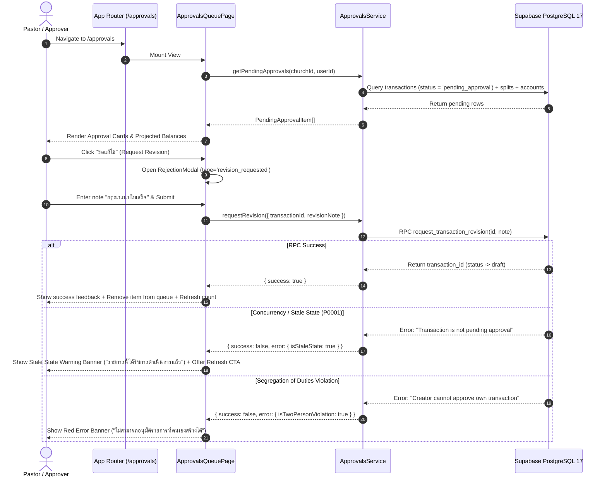

# Milestone 2 — Phase 2.2: Application Integration Plan

**Project:** Grace Ledger  
**Milestone:** M2 — Core Financial Workflows  
**Sub-Phase:** Phase 2.2 — Application Integration (Connecting Verified Governance to Live UI)  
**Date:** 2026-08-18  
**Status:** **PROPOSAL READY FOR PRODUCT OWNER REVIEW (STOPPED BEFORE IMPLEMENTATION)**  

---

## 1. Current Frontend Architecture Audit

### 1.1 Codebase & Dependency Inspection
- **Package Manager & Bundler**: Vite (`"dev": "vite"`, `"build": "tsc --noEmit"`).
- **Core Dependencies**:
  - `@supabase/supabase-js` (^2.49.1) — Live database & RPC communication.
  - `decimal.js` (^10.5.0) — Precision financial arithmetic engine (`Money`).
  - `zod` (^3.24.2) — Runtime schema validation.
- **Testing & Tooling**:
  - `vitest` (^3.0.7) — Unit & component test runner.
  - `typescript` (^5.8.2) — Strict type safety (`"jsx": "react-jsx"`, `"strict": true`).
- **Current `src/` Directory Structure**:
  ```text
  src/
  ├── components/
  │   └── approvals/
  │       ├── ApprovalDecisionSheet.ts    # Decision modal / detail card
  │       ├── ApprovalsQueueView.ts       # Pending queue list & summary
  │       ├── ProjectedBalanceCard.ts     # Multi-fund balance projection UI
  │       ├── RejectionModal.ts           # Modal for revision/rejection reasons
  │       ├── StatusBadge.ts              # Semantic status badges (6 states)
  │       └── index.ts                    # Barrel export
  └── lib/
      ├── money.ts                        # Precision financial domain primitives
      ├── rbac.ts                         # Church RBAC authorization matrix
      ├── supabase/
      │   └── types.ts                    # Synchronized Supabase DB/RPC types
      └── transactions/
          ├── approvals-service.ts        # Typed client wrapper for RPCs & queries
          ├── lifecycle.ts                # State machine & transition validator
          ├── projected-balance-engine.ts # Real-time mathematical projected balance
          ├── split-engine.ts             # Multi-fund split parity validator
          └── types.ts                    # Domain types
  ```

### 1.2 Frontend Framework & Entrypoint Assessment
1. **Framework**: The project is structured with TypeScript + DOM/React-compatible rendering primitives with Vite as the dev server.
2. **Current Entry Point**: No top-level HTML entry point (`index.html`) or app bootstrap (`src/main.ts` / `src/App.ts`) exists currently in the root.
3. **Design System**: Full design system tokens and guidelines exist in `design-system-extracted/tokens/` (`colors.css`, `typography.css`, `spacing.css`, `radius.css`, `shadows.css`, `motion.css`, `fonts.css`, `base.css`) and 18 mobile mockups in `mockups-extracted/`.
4. **Current Calling Status**: The approval components in `src/components/approvals/` are fully implemented and unit-tested, but they currently lack an integrated application page/route that mounts them to the browser DOM.

---

## 2. Route Contract & Application Structure

To keep the application lightweight, fast, and maintainable without unnecessary external framework bloat, we define a clean, deterministic routing structure:

```text
/                      -> Dashboard / Overview (with "ต้องการให้คุณตรวจสอบ" pending alert)
/approvals             -> Approvals Queue Inbox (List of pending items, filters, summaries)
/approvals/:id         -> Approval Decision Sheet / Transaction Detail (Hero, Projections, Actions)
```

### Route Specifications

| Route Path | View / Component | Primary Actor Roles | Key Responsibilities |
| :--- | :--- | :--- | :--- |
| `/` | `DashboardView` | All church members | Overview KPIs, Recent Activity, Alert Card showing pending approval count. |
| `/approvals` | `ApprovalsQueuePage` | Approver, Pastor, Treasurer, Admin | Displays list of items awaiting approval, search, status filter, and bulk summary stats. |
| `/approvals/:id` | `ApprovalDetailPage` | Approver, Pastor, Treasurer, Admin | Deep-dive evaluation: Hero amount, Segregation of Duties banner, multi-fund projected balances, and Action Buttons (Approve, Request Revision, Reject). |

---

## 3. Application Data Flow & State Lifecycle



### Action State Table

| Action | RPC Called | Optimistic / Loading State | Success State | Error / Stale State |
| :--- | :--- | :--- | :--- | :--- |
| **Approve** | `approve_transaction` | Button shows spinner, disabled | Item removed with green confirmation; audit logged | Stale warning if already approved/rejected; Two-person error if creator |
| **Request Revision** | `request_transaction_revision` | Modal submit disabled + spinner | Item reverted to draft; creator notified; removed from approver queue | Error message displayed if note $<5$ chars or transaction not pending |
| **Formal Reject** | `reject_transaction_terminal` | Modal submit disabled + spinner | Item locked to `rejected`; permanently removed from queue | Error message displayed if reason $<5$ chars or transaction not pending |

---

## 4. Role-Based Access & Two-Person Rule Enforcement

1. **Approver Authorization**:
   - `ApprovalsQueuePage` checks if the current user has `has_church_access(church_id, 'approver')`.
   - If user is a `member` or `counter`, the page displays an access restriction notice: *"คุณไม่มีสิทธิ์ในการอนุมัติรายการเงินของคริสตจักร"*
2. **Two-Person Rule (Segregation of Duties)**:
   - When viewing a voucher created by `auth.uid()`:
     - `isCreator === true`.
     - Approver action button **"อนุมัติ" is disabled** with a warning badge: *"คุณเป็นผู้สร้างรายการนี้ — ต้องให้ผู้อนุมัติท่านอื่นเป็นผู้พิจารณา"*
     - Server RPC enforces this check unconditionally as the ultimate security boundary.
3. **Terminal Rejection Lockdown**:
   - Items with `status = 'rejected'` can never be rendered in the pending approvals queue and cannot be approved or resubmitted.

---

## 5. UI / UX Design System Integration

1. **Tokens & Typography**:
   - Root stylesheet imports `design-system-extracted/tokens/` (`colors.css`, `typography.css`, `spacing.css`, `radius.css`, `shadows.css`, `fonts.css`).
   - Fonts: **Sarabun** for Thai UI text, **Inter** with `.num-display` for Latin numbers and currency (`฿`).
   - Background: Warm off-white (`#FFFCF8`), Cards: Clean white (`#FFFFFF`) with 1px hairline border (`var(--border)`).
2. **UI Components Reused**:
   - [`StatusBadge`](file:///c:/Users/Administrator/Desktop/grace-v.2/grace-ledger/src/components/approvals/StatusBadge.ts) (Draft, Pending Approval, Approved, Posted, Rejected, Voided).
   - [`ProjectedBalanceCard`](file:///c:/Users/Administrator/Desktop/grace-v.2/grace-ledger/src/components/approvals/ProjectedBalanceCard.ts) (Real-time multi-split fund impact + deficit alert).
   - [`ApprovalDecisionSheet`](file:///c:/Users/Administrator/Desktop/grace-v.2/grace-ledger/src/components/approvals/ApprovalDecisionSheet.ts) (Detail view, hero amount, two-person warning).
   - [`RejectionModal`](file:///c:/Users/Administrator/Desktop/grace-v.2/grace-ledger/src/components/approvals/RejectionModal.ts) (Mandatory $\ge 5$ chars reason with live char counter).
   - [`ApprovalsQueueView`](file:///c:/Users/Administrator/Desktop/grace-v.2/grace-ledger/src/components/approvals/ApprovalsQueueView.ts) (Inbox cards with creator initials and status).

---

## 6. Proposed Files & Implementation Architecture

### 6.1 New Files to be Created in Phase 2.2
1. `index.html`: Web application entrypoint referencing fonts and `src/main.ts`.
2. `src/styles/app.css`: Root application stylesheet importing design system tokens.
3. `src/lib/supabase/client.ts`: Supabase browser client factory with environment configuration.
4. `src/router.ts`: Lightweight, client-side route manager handling `/`, `/approvals`, and `/approvals/:id`.
5. `src/pages/ApprovalsPage.ts`: Controller and page view connecting `ApprovalsService` to `ApprovalsQueueView` and `ApprovalDecisionSheet`.
6. `src/pages/DashboardPage.ts`: Overview page displaying church balances, pending alerts, and navigation links.
7. `src/main.ts`: Application bootstrap mounting the router to `#app`.

### 6.2 Tests to be Added
1. `tests/unit/app-router.test.ts`: Route parsing, navigation, parameter extraction (`:id`).
2. `tests/unit/approvals-page.test.ts`: Page mounting, queue fetching, decision modal triggers, Two-Person rule UI state.
3. `scripts/m2_phase2_2_e2e_workflow_test.mjs`: Full end-to-end integration test verifying the complete user workflow against real Supabase PostgreSQL 17:
   - Creator creates & submits voucher.
   - Approver opens queue and inspects details.
   - Approver executes decision (Approve / Request Revision / Reject).
   - Database state transitions correctly.
   - Queue reflects updated status immediately.

---

## 7. Risks & Mitigation Strategies

| Risk | Impact | Mitigation |
| :--- | :--- | :--- |
| **Missing Environment Config** | Supabase client fails to connect in browser | Provide fallback config pointing to the verified test project URL/Anon key. |
| **Font Rendering Delay** | FOUT (Flash of Unstyled Text) | Load Google Fonts (Sarabun & Inter) via `<link>` in `index.html` with `preconnect`. |
| **Concurrency / Stale State** | Approver acts on outdated voucher | `ApprovalsService` catches `P0001` and displays inline refresh alert without crashing. |
| **DOM Event Listener Leaks** | Memory leaks on route change | Clean up event listeners in component lifecycle teardown. |

---

## 8. Definition of Done for M2 Phase 2.2

- [ ] `index.html` and root styles created with design system tokens.
- [ ] Client router routes `/`, `/approvals`, `/approvals/:id` correctly.
- [ ] `ApprovalsPage` fetches and renders real pending items from Supabase.
- [ ] "อนุมัติ", "ขอแก้ไข", and "ปฏิเสธ" trigger their respective RPCs with live feedback.
- [ ] Stale state conflict shows clear Thai notification with refresh action.
- [ ] Two-Person Rule properly disables approval button for creator.
- [ ] All unit and component tests pass (`npm test`).
- [ ] TypeScript typecheck and Vite build pass with 0 errors.
- [ ] Real database E2E integration test passes against live Supabase PostgreSQL 17.
