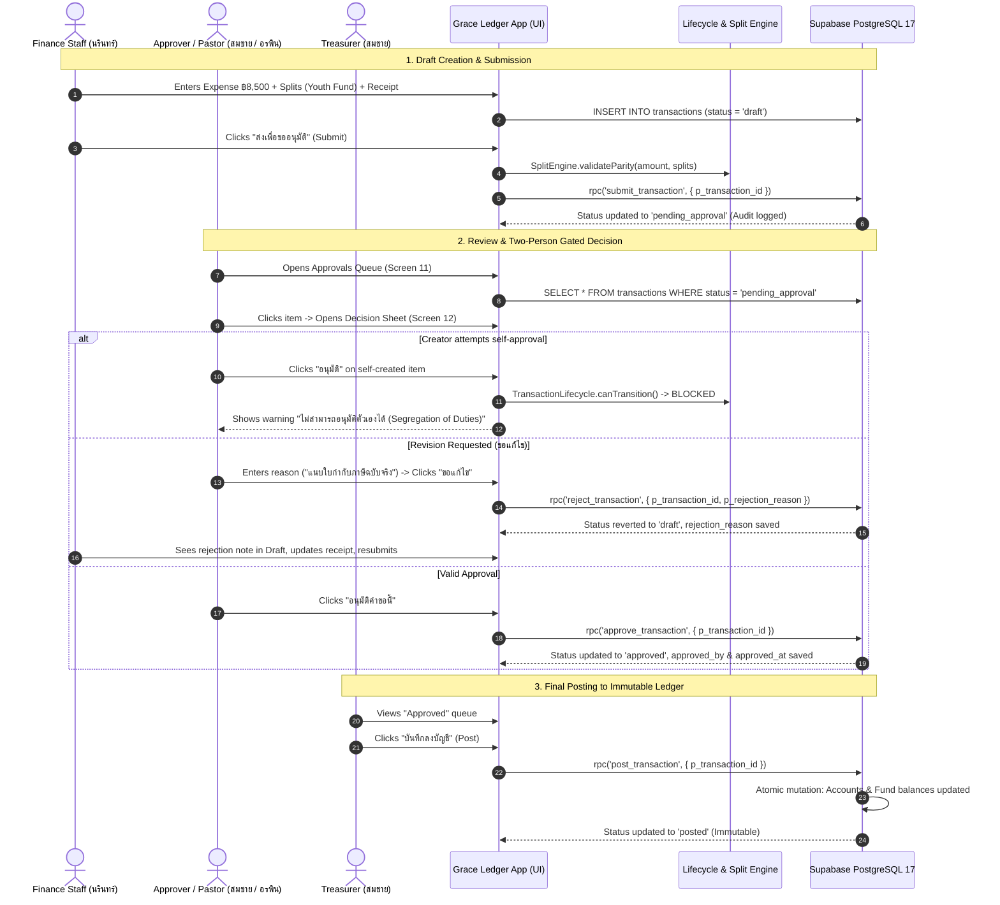

# Milestone 2 — Phase 2: Approval Workflow UX Architecture & Discovery

**Project:** Grace Ledger  
**Milestone:** M2 — Core Financial Workflows  
**Phase:** Phase 2 — Approval Workflow UX  
**Date:** 2026-08-18  
**Author:** Principal Frontend & System Architect  
**Status:** **DISCOVERY & ARCHITECTURE REVIEW (READY FOR PRODUCT OWNER APPROVAL)**  

---

## 1. Executive Summary & Context

Milestone 1 (Database Foundation, Multi-Tenant Isolation, RBAC, Financial Precision, and Audit Immutability) and Milestone 2 Phase 1 (Transaction Core, Migration 005, Split-Sum Parity Trigger, Two-Person Rule RPCs, and Live PostgreSQL 17 Verification) have been **100% verified on the real Supabase test database (`grace-ledger-test`)**.

This document represents the **UX Architecture & Technical Discovery Review** for **M2 Phase 2: Approval Workflow UX**. In accordance with the Project Directives:
- **No source code was modified.**
- **No database migrations were changed.**
- **No components were created.**
- **No dependencies were installed.**

This report establishes the complete structural bridge between the verified database engine and the church-specific UX designs before any implementation begins.

---

## 2. Frontend Architecture & Current State Analysis

### 2.1 Codebase & Workspace State
- **Current Runtime Stack**: Node.js / Vite / TypeScript 5.8 / Vitest 3.0 / Supabase JS 2.49 / Decimal.js 10.5 / Zod 3.24.
- **Design System Stack**: React 19 + TanStack Router/Start + Tailwind CSS v4 + shadcn/ui primitives.
- **Design Tokens & Foundation**: Located in [`design-system-extracted/`](file:///c:/Users/Administrator/Desktop/grace-v.2/grace-ledger/design-system-extracted), containing full CSS token sheets (`colors.css`, `typography.css`, `spacing.css`, `radius.css`, `shadows.css`, `motion.css`, `fonts.css`, `base.css`).
- **Typography Standards**:
  - Thai UI Copy: **Sarabun** (15px / line-height 1.6).
  - Latin, UI, & Numerals: **Inter** (`.num-display` with `font-variant-numeric: tabular-nums lining-nums`).
  - Currency representation: Explicit `฿` with 2 decimal places, exact arithmetic (never rounded or shortened).
- **Color Palette & Meanings**:
  - Background: Off-white (`#FFFCF8` / `var(--gl-bg)`).
  - Cards: Pure white (`#ffffff` / `var(--card)`) with 1px border (`var(--border)`).
  - Brand Accent: Orange (`#f97316` / `var(--primary)`) reserved exclusively for primary CTAs and active tabs.
  - Financial Status Hues:
    - **Income / Approved**: Emerald (`oklch(0.5 0.13 155)` / `var(--income)`).
    - **Expense / Rejected**: Crimson/Red (`oklch(0.55 0.17 25)` / `var(--expense)`).
    - **Offering / Pending**: Warm Amber (`oklch(0.7 0.13 80)` / `var(--pending)` / `var(--warning)`).

---

## 3. Mockup Analysis & Screen Mapping

The product design documents 18 mobile screens across 5 core workflows plus a desktop UI kit. The Approval Workflow is represented in the following specific screens:

```text
┌────────────────────────────────────────────────────────────────────────────────────────┐
│                        APPROVAL WORKFLOW SCREEN ECOSYSTEM                              │
├────────────────────────────────────────────────────────────────────────────────────────┤
│ 1. Home Dashboard [Screen 01]                                                          │
│    └── "ต้องการให้คุณตรวจสอบ" Banner (Pending count, total sum, oldest item age)        │
│                                                                                        │
│ 2. Transactions Hub [Screen 02]                                                        │
│    └── Segmented Filter Tab: "รออนุมัติ" (Shows pending status badge per item)         │
│                                                                                        │
│ 3. Approvals Queue [Screen 11 / Desktop Approvals.jsx]                                 │
│    └── Dedicated list of all pending items with requester avatar, fund, elapsed time  │
│                                                                                        │
│ 4. Approval Decision Bottom Sheet [Screen 12]                                          │
│    └── Focused decision sheet: Amount, Fund, Balance-After-Approval, Receipt, 3 CTAs: │
│        [อนุมัติคำขอนี้] (Approve) / [ขอแก้ไข] (Request Revision) / [ปฏิเสธ] (Reject)  │
│                                                                                        │
│ 5. Transaction Detail & Audit [Screen 03]                                              │
│    └── Deep dive: Multi-split breakdown, attached receipt viewer, immutable timeline │
│                                                                                        │
│ 6. Audit Trail [Screen 13] & Notifications [Screen 14]                                 │
│    └── Real-time immutable event log & push/in-app alert banner                        │
└────────────────────────────────────────────────────────────────────────────────────────┘
```

### Screen Details for Approval Concerns:
1. **Screen 01 (Home)**: Shows aggregated badge ("3 รายการรออนุมัติจากคุณ · รวม ฿73,500.00 · เก่าสุด 2 วัน").
2. **Screen 11 (Approvals Queue)**: Lists pending requests with requester chip, amount, fund, receipt attachment indicator, and fast-action buttons (`ดูรายละเอียด`, `อนุมัติ`).
3. **Screen 12 (Decision Sheet)**:
   - Header: EXP code, title ("ซื้ออุปกรณ์ห้องเยาวชน"), `StatusBadge status="pending"`.
   - Amount: Large tabular display (`−฿8,500.00`).
   - Summary card: Fund name, **projected remaining balance** (`คงเหลือหลังอนุมัติ ฿3,510.00`), requester name, attachment link.
   - Requester reason card (`เหตุผลจากผู้ขอ`).
   - Action buttons:
     - Primary: `อนุมัติคำขอนี้` (Calls `approve_transaction`).
     - Outline: `ขอแก้ไข` (Reverts to draft with revision note).
     - Ghost: `ปฏิเสธ` (Reverts to draft with rejection reason).
4. **Screen 03 (Transaction Detail + Audit)**: Full transaction breakdown with split lines, receipt preview, and historical timeline (`รอการอนุมัติ` $\rightarrow$ `แนบใบเสร็จ` $\rightarrow$ `สร้างรายการ`).

---

## 4. Component Reuse & Design System Matrix

The 14 pre-built design system components in `design-system-extracted/components/` map directly to the Approval Workflow needs:

| Component | Path | Approval Workflow Purpose |
| :--- | :--- | :--- |
| **`StatusBadge`** | `components/feedback/StatusBadge.jsx` | Renders `pending` (yellow), `approved` (emerald), `draft` (gray), `posted` (green), `voided` (red). |
| **`MoneyText`** | `components/data/MoneyText.jsx` | Formats currency with `.num-display`, `฿`, and `income` / `expense` tones. |
| **`Button`** | `components/forms/Button.jsx` | Primary (`อนุมัติ`), Outline (`ขอแก้ไข`, `ดูรายละเอียด`), Ghost/Destructive (`ปฏิเสธ`). |
| **`EmptyState`** | `components/feedback/EmptyState.jsx` | Renders "ไม่มีรายการค้างอนุมัติ" with procedural Thai copy. |
| **`Card` / `StatCard`** | `components/data/Card.jsx` | Containers for pending item rows, fund summaries, and reason callouts. |
| **`PageHeader`** | `components/navigation/PageHeader.jsx` | Screen title, kicker ("กำกับดูแล"), and context description. |
| **`Tabs`** | `components/navigation/Tabs.jsx` | Filter tabs (ทั้งหมด, รายรับ, รายจ่าย, รออนุมัติ, อนุมัติแล้ว). |
| **`Dialog` / Sheet** | `components/overlays/Dialog.jsx` | Decision Modal (Desktop) / Bottom Sheet (Mobile Screen 12). |
| **`Input` / `Select`** | `components/forms/Input.jsx` | Textarea for mandatory rejection/revision reason ($ \ge 5 $ chars). |

---

## 5. Role Matrix & User Journeys

### 5.1 Role Authority Matrix

| Action | Super Admin | Pastor (ศิษยาภิบาล) | Treasurer (เหรัญญิก) | Finance Staff (ธุรการ) | Approver (ผู้ตรวจ) | Counter (ผู้นับเงิน) | Member (สมาชิก) |
| :--- | :---: | :---: | :---: | :---: | :---: | :---: | :---: |
| **View Queue** | ✅ | ✅ | ✅ | ✅ (Own items) | ✅ | ❌ | ❌ |
| **Create Draft** | ✅ | ✅ | ✅ | ✅ | ❌ | ❌ | ❌ |
| **Edit Draft** | ✅ | ✅ | ✅ | ✅ (Own drafts) | ❌ | ❌ | ❌ |
| **Submit Draft** | ✅ | ✅ | ✅ | ✅ | ❌ | ❌ | ❌ |
| **Approve** | ✅* | ✅* | ✅* | ❌ | ✅* | ❌ | ❌ |
| **Reject / Edit Req** | ✅ | ✅ | ✅ | ❌ | ✅ | ❌ | ❌ |
| **Post to Ledger**| ✅ | ✅ | ✅ | ❌ | ❌ | ❌ | ❌ |
| **Void & Reversal**| ✅ | ✅ | ✅ | ❌ | ❌ | ❌ | ❌ |

*\*Enforces Two-Person Rule: User cannot approve any transaction where `created_by == auth.uid()`.*

### 5.2 Specific User Journeys



---

## 6. End-to-End Architectural Data Flow

```text
DATABASE LAYER (PostgreSQL 17)
  ├── Table: transactions (status, amount, created_by, approved_by, approved_at, rejected_by, rejection_reason)
  ├── Table: transaction_splits (fund_id, category_id, amount)
  ├── Trigger: fn_validate_transaction_split_lifecycle (locks posted rows, enforces split parity)
  └── Stored Procedures: submit_transaction, approve_transaction, reject_transaction, post_transaction, void_transaction
             │
             ▼
RPC WRAPPER & API SERVICE LAYER (TypeScript / Supabase Client)
  ├── ApprovalsService.getPendingQueue(churchId)
  ├── ApprovalsService.submit(transactionId)
  ├── ApprovalsService.approve(transactionId, note?)
  ├── ApprovalsService.reject(transactionId, reason)
  ├── ApprovalsService.post(transactionId)
  └── ApprovalsService.void(transactionId, reason)
             │
             ▼
DOMAIN & VALIDATION LAYER
  ├── Money (2-decimal precision arithmetic)
  ├── SplitEngine (split sum parity check, remaining balance calculation)
  ├── TransactionLifecycle.canTransition() (State machine + Two-Person Rule assertion)
  └── RBAC.can(role, action, resource)
             │
             ▼
UI / PRESENTATION LAYER (Mobile OS & Desktop Design System)
  ├── ApprovalsQueueScreen (Screen 11 / Desktop Approvals)
  ├── ApprovalDecisionSheet (Screen 12 Bottom Sheet / Modal)
  ├── TransactionDetailView & AuditTimeline (Screen 03)
  ├── TwoPersonRuleGuard (Disabled CTA + explanatory helper text)
  └── StatusBadge, MoneyText, EmptyState, Toast Notifications
```

---

## 7. Approval State UX Specifications

| State | Visual Badge | User Permissions & Restrictions | Actions Available |
| :--- | :--- | :--- | :--- |
| **`draft`** | Gray Pill `ฉบับร่าง` | Creator / Staff can edit all fields, splits, and attachments. Not posted to ledger. | - Edit Details<br>- Add/Remove Splits<br>- `ส่งเพื่อขออนุมัติ` (Submit)<br>- `บันทึกลงบัญชีทันที` (Treasurer only) |
| **`pending_approval`** | Amber Pill `รออนุมัติ` | Read-only for creator. Actionable by designated approvers (except creator). | - `อนุมัติคำขอนี้` (Approve)<br>- `ขอแก้ไข` (Revert to Draft with note)<br>- `ปฏิเสธ` (Reject with reason) |
| **`approved`** | Blue Pill `อนุมัติแล้ว` | Read-only. Approved by 2nd person, queued for Treasurer to post to ledger. | - `บันทึกลงบัญชี` (Post to Ledger)<br>- `ยกเลิก` (Void) |
| **`posted`** | Emerald Pill `บันทึกแล้ว` | **Strictly Immutable**. Account and Fund balances have been updated. | - `ยกเลิกรายการ` (Void & create balancing reversal) |
| **`voided`** | Red Pill `ยกเลิกแล้ว` | Read-only. Strikethrough display. Linked to balancing reversal record. | - View Reversal Record<br>- View Audit History |

---

## 8. UX Feedback & Error Handling States

```text
┌────────────────────────────────────────────────────────────────────────────────────────┐
│                               UX FEEDBACK MATRIX                                       │
├────────────────────────────────────────────────────────────────────────────────────────┤
│ 1. Loading States:                                                                     │
│    - Queue fetch: 3 Skeleton Card rows with shimmer effect.                            │
│    - Action execution (Approve/Reject): Button shows inline spinner + "กำลังบันทึก...". │
│                                                                                        │
│ 2. Empty States:                                                                       │
│    - When no pending items: EmptyState icon + "ไม่มีรายการค้างอนุมัติ"                 │
│      Subtitle: "รายการใหม่ที่ส่งมาขออนุมัติจะปรากฏที่นี่".                             │
│                                                                                        │
│ 3. Validation States:                                                                  │
│    - Rejection reason < 5 chars: Inline helper turns red: "กรุณาระบุเหตุผลอย่างน้อย 5 ตัวอักษร"│
│    - Split parity mismatch on submit: Banner: "ยอดรวมหมวดย่อยไม่ตรงกับยอดรายการ".       │
│                                                                                        │
│ 4. Two-Person Rule Warning:                                                            │
│    - When creator views own pending item: Primary "อนุมัติ" button is disabled with   │
│      notice: "คุณเป็นผู้สร้างรายการนี้ ไม่สามารถอนุมัติตัวเองได้ ตามหลักการแบ่งแยกหน้าที่"│
│                                                                                        │
│ 5. Success Notifications:                                                              │
│    - Toast banner (Top/Bottom 3s): "อนุมัติรายการ EXP-0248 เรียบร้อยแล้ว".             │
│    - Instant optimistic removal from queue with smooth slide-out transition.           │
│                                                                                        │
│ 6. Error & Network Failure:                                                            │
│    - RPC failure: Persistent Alert banner with retry button.                           │
│    - Thai error translation: "เกิดข้อผิดพลาด: สิทธิ์การใช้งานไม่ถูกต้อง กรุณาลองใหม่อีกครั้ง"│
└────────────────────────────────────────────────────────────────────────────────────────┘
```

---

## 9. Technical & UX Risks and Mitigation

| Risk Category | Identified Risk | Impact | Architectural Mitigation Strategy |
| :--- | :--- | :--- | :--- |
| **UX Risk** | **Self-Approval Confusion** | User wonders why they cannot click "อนุมัติ" on their own expense request. | Render explicit **Two-Person Rule Helper Chip** explaining church governance policy. |
| **UX Risk** | **Accidental Rejection** | Approver clicks reject by mistake, losing context. | Mandate interactive rejection modal requiring $\ge 5$ character explanation. |
| **UX Risk** | **Incomplete Context During Decision** | Approver cannot see if fund has enough money. | Display real-time **Projected Fund Balance After Approval** (`คงเหลือหลังอนุมัติ`) directly inside Sheet 12. |
| **Technical Risk** | **Optimistic State Desync** | Local UI marks item approved but RPC fails on network drop. | Use SWR/TanStack Query mutation rollbacks with explicit error toast on RPC rejection. |
| **Technical Risk** | **Simultaneous Multi-Approver Action** | Two approvers open Sheet 12 at the same time and both click approve. | Database RPC executes `SELECT ... FOR UPDATE`, guaranteeing only first transaction succeeds; second gets safe 409 error. |
| **Technical Risk** | **Stale Queue Badges** | Home Screen 01 badge shows "3 items" when an item was already approved. | Invalidate and refetch pending queue cache upon every workflow mutation. |

---

## 10. Audit of Discrepancies & Mismatches

During this discovery phase, four specific discrepancies were identified across documentation, types, and mockups:

1. **TypeScript Types Mismatch (`src/lib/supabase/types.ts`)**:
   - `TransactionStatusEnum` currently defines `"draft" | "pending_approval" | "posted" | "rejected" | "voided"`.
   - Migration 005 successfully added `'approved'` to the database enum.
   - **Resolution Plan**: Update `TransactionStatusEnum` in `src/lib/supabase/types.ts` to include `'approved'`.
2. **Rejection State Modeling**:
   - In Migration 005 and `TransactionLifecycle`, rejection reverts status to `draft` (setting `rejected_by`, `rejected_at`, `rejection_reason`) so the creator can edit and resubmit.
   - `types.ts` previously had a legacy standalone `'rejected'` status.
   - **Resolution Plan**: Align UI to reflect `status === 'draft' && rejection_reason != null` as "ฉบับร่าง (ขอแก้ไข)".
3. **Mockup 03 vs Mockup 12 Action Button Parity**:
   - Mockup 03 shows a 2-button footer (`ขอแก้ไข`, `อนุมัติรายการนี้`).
   - Mockup 12 shows a 3-button bottom sheet (`อนุมัติคำขอนี้`, `ขอแก้ไข`, `ปฏิเสธ`).
   - **Resolution Plan**: Unify action sheet so both "ขอแก้ไข" (revert to draft with revision request) and "ปฏิเสธ" (revert to draft with rejection note) call `reject_transaction(id, reason)`.
4. **Mockup Data Binding vs Real RPC**:
   - `design-system-extracted/ui_kits/grace-ledger/Approvals.jsx` uses hardcoded `window.MOCK.pending`.
   - **Resolution Plan**: Connect the Approvals UI component to real `ApprovalsService` backed by Supabase RPCs.

---

## 11. Proposed Safe Implementation Plan (Phase 2)

Following Product Owner approval, M2 Phase 2 should be implemented in 4 strict incremental steps:

```text
┌────────────────────────────────────────────────────────────────────────────────────────┐
│ STEP 1: TYPE DEFINITION & SERVICE CONTRACTS                                            │
│  - Update TransactionStatusEnum in src/lib/supabase/types.ts (add 'approved')         │
│  - Create src/lib/transactions/approvals-service.ts (typed Supabase RPC client wrapper)│
└────────────────────────────────────────────────────────────────────────────────────────┘
                                   ↓
┌────────────────────────────────────────────────────────────────────────────────────────┐
│ STEP 2: PRESENTATIONAL UI COMPONENTS (Extracted from Design System)                    │
│  - Adapt StatusBadge, MoneyText, Card, StatCard, Button, EmptyState for App runtime   │
│  - Create ApprovalsQueueItem component with Thai formatting and status indicators      │
│  - Create TwoPersonRuleGuard banner component                                          │
└────────────────────────────────────────────────────────────────────────────────────────┘
                                   ↓
┌────────────────────────────────────────────────────────────────────────────────────────┐
│ STEP 3: INTERACTIVE WORKFLOW SHEETS & VIEWS                                            │
│  - Implement ApprovalDecisionSheet (Mockup 12) with Approve / Request Edit / Reject    │
│  - Implement ApprovalsQueueView (Mockup 11 & Desktop View)                             │
│  - Implement RejectionReasonModal (Mandatory >= 5 chars validation)                    │
│  - Implement TransactionDetailAuditTimeline (Mockup 03)                                │
└────────────────────────────────────────────────────────────────────────────────────────┘
                                   ↓
┌────────────────────────────────────────────────────────────────────────────────────────┐
│ STEP 4: VERIFICATION & TESTING                                                         │
│  - Unit tests for ApprovalsService and UI state transitions (100% pass)                │
│  - Real Supabase PostgreSQL 17 test suite validating UI service calls against RPCs     │
└────────────────────────────────────────────────────────────────────────────────────────┘
```

---

## 12. Testing Strategy & Definition of Done

### Automated Testing Suite (Phase 2):
1. **Unit Tests (`tests/unit/approvals-service.test.ts`)**:
   - Service mapping of RPC errors into localized Thai messages.
   - Client-side validation of rejection notes ($< 5$ characters blocked).
   - Segregation of Duties client-side assertion matching domain lifecycle.
2. **Real Supabase Integration Tests (`scripts/m2_phase2_ux_service_test.mjs`)**:
   - Fetch pending approval queue for Church A (returns only Church A items).
   - Execute `submit`, `approve`, `reject`, and `post` via service layer.
   - Verify self-approval rejection error propagation.

### Definition of Done for Phase 2:
- [ ] `docs/M2_PHASE_2_DISCOVERY.md` reviewed and approved by Product Owner.
- [ ] Supabase TypeScript types synchronized with Migration 005 (`approved` status added).
- [ ] UI components strictly adhere to `design-system-extracted/` tokens and Sarabun/Inter typography.
- [ ] Screen 11 (Approvals Queue) and Screen 12 (Decision Sheet) match mockups.
- [ ] Two-Person Rule clearly communicated in UI when creator views own item.
- [ ] 0 TypeScript errors (`npm run typecheck`).
- [ ] 100% Vitest unit test pass (`npm test`).
- [ ] 100% Real PostgreSQL 17 integration test pass.
