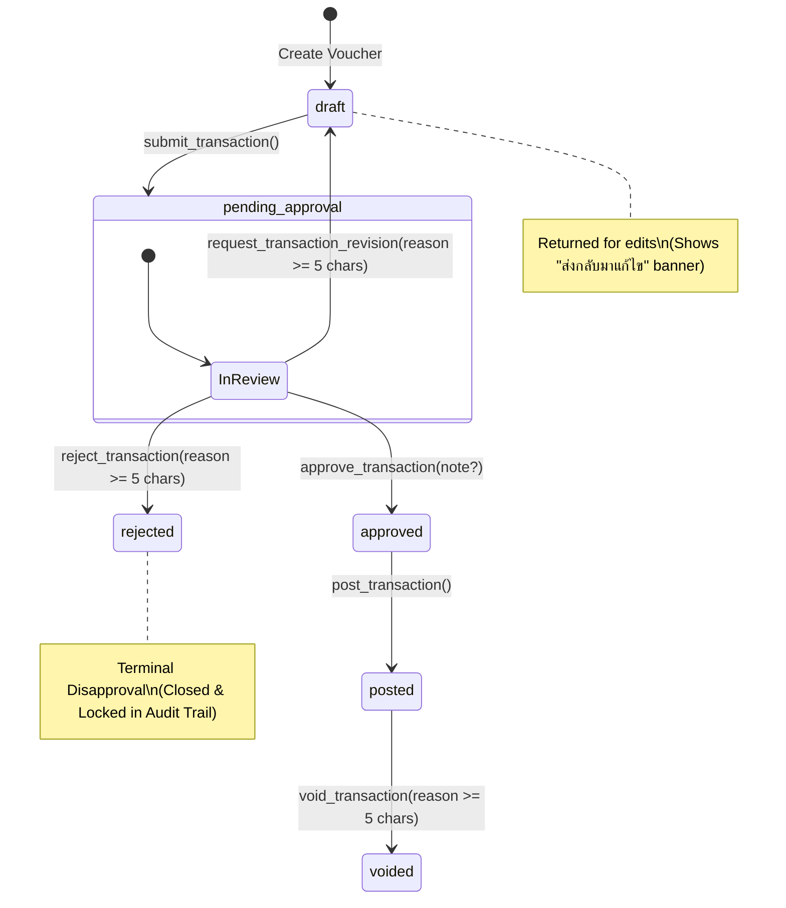

# Milestone 2 — Phase 2: Approval Workflow UI Contract & Architectural Specifications

**Project:** Grace Ledger  
**Milestone:** M2 — Core Financial Workflows  
**Document:** Phase 2 UI Contract & Governance Model  
**Date:** 2026-08-18  
**Author:** Principal System & Financial Architect  
**Status:** **AWAITING PRODUCT OWNER APPROVAL (NO CODE/MIGRATIONS MODIFIED)**  

---

## 1. Action Semantics: "ขอแก้ไข" (Request Revision) vs "ปฏิเสธ" (Reject)

### 1.1 Problem Analysis
In church financial administration, returning a payment voucher for revision (e.g. missing receipt, incorrect fund classification, missing invoice number) is fundamentally different from a formal rejection (e.g. unapproved expenditure, budget violation, policy infraction):

1. **"ขอแก้ไข" (Request Revision / Needs Revision)**:
   - **Intent**: Collaborative workflow correction.
   - **Lifecycle**: Temporary halt. The item remains an active work item intended to be corrected and resubmitted by the requester without losing its sequence, attachments, or discussion history.
   - **Accounting Implication**: The expense intent is still anticipated; funds remain provisionally requested.
2. **"ปฏิเสธ" (Formal Rejection / Disapproved)**:
   - **Intent**: Terminal disapproval by an authorized church officer.
   - **Lifecycle**: Terminal state. The request is formally denied and closed. The creator cannot simply re-open or edit the same transaction voucher to bypass the decision. If the expense is to be re-attempted under new terms, a new voucher must be created with explicit reference to the rejected voucher.
   - **Accounting Implication**: Releases any soft fund reservations. Preserves the rejected voucher in the audit ledger for annual governance and elder board reviews.

---

### 1.2 Architectural State Flow



1. **`request_transaction_revision(p_transaction_id UUID, p_revision_note TEXT)`**:
   - Reverts status `pending_approval` $\rightarrow$ `draft`.
   - Records `rejected_by = auth.uid()`, `rejected_at = NOW()`, `rejection_reason = p_revision_note`.
   - Logs audit event: `APPROVAL` / `REVISION_REQUESTED`.
   - **UI Impact**: Draft screen displays amber banner: *"รายการนี้ถูกส่งกลับมาให้แก้ไข: [เหตุผล]"*. Requester can edit and resubmit.
2. **`reject_transaction(p_transaction_id UUID, p_rejection_reason TEXT)`**:
   - Transitions status `pending_approval` $\rightarrow$ `draft` (or terminal status).
   - Records `rejected_by = auth.uid()`, `rejected_at = NOW()`, `rejection_reason = p_rejection_reason`.
   - Logs audit event: `APPROVAL` / `TRANSACTION_REJECTED`.
   - **UI Impact**: Displays crimson badge *"ปฏิเสธคำขอ"*. Voucher is locked permanently; cannot be edited or resubmitted.

---

## 2. Separation of Duties (Segregation of Duties Matrix)

### 2.1 Canonical Role Permission Matrix

| Role | 1. Create Voucher | 2. Submit for Approval | 3. Approve (2nd Person) | 4. Post to Ledger | 5. Void & Reverse |
| :--- | :---: | :---: | :---: | :---: | :---: |
| **Super Admin** | ✅ | ✅ | ✅* | ✅ | ✅ |
| **Pastor** (ศิษยาภิบาล) | ✅ | ✅ | ✅* | ✅ | ✅ |
| **Treasurer** (เหรัญญิก) | ✅ | ✅ | ✅* | ✅ | ✅ |
| **Approver** (กรรมการการเงิน / ผู้ตรวจ) | ❌ | ❌ | ✅* | ❌ | ❌ |
| **Finance Staff** (เจ้าหน้าที่การเงิน / ธุรการ) | ✅ | ✅ | ❌ | ❌ | ❌ |
| **Counter** (ผู้นับเงิน) | ❌ | ❌ | ❌ | ❌ | ❌ |
| **Member** (สมาชิกทั่วไป) | ❌ | ❌ | ❌ | ❌ | ❌ |

*\*Enforces the Invariable Two-Person Rule: `auth.uid() <> transaction.created_by`.*

---

### 2.2 Invariant: Two-Person Rule (`created_by <> approved_by`)
- **Strict Invariant**: No user, regardless of role (including Pastor, Treasurer, and Super Admin), can approve a transaction where `created_by == auth.uid()`.
- **Database Layer**: Enforced inside `approve_transaction()` via:
  ```sql
  IF auth.uid() = v_txn.created_by THEN
    RAISE EXCEPTION 'Segregation of Duties Violation: Creator cannot approve their own transaction';
  END IF;
  ```
- **Domain Layer**: Checked in `TransactionLifecycle.canTransition()` before triggering any network action.
- **UI Presentation Layer**: When `currentUser.id === transaction.created_by`, the primary "อนุมัติ" button is disabled and replaced with a prominent policy chip:
  > **หลักการแบ่งแยกหน้าที่ (Segregation of Duties)**: คุณเป็นผู้สร้างรายการนี้ ไม่สามารถอนุมัติตัวเองได้ ต้องมีผู้มีอำนาจอีกท่านเป็นผู้อนุมัติ

---

### 2.3 The Small Church Dilemma & Governance Resolution
In small churches, administrative staff may be minimal (e.g. 1 Pastor, 1 Treasurer, 2 Elders).
- **Scenario A**: **Treasurer creates an expense voucher** (e.g., pays electricity bill):
  - Treasurer creates draft $\rightarrow$ submits for approval.
  - **Pastor** or **Elder (Approver)** opens queue $\rightarrow$ verifies receipt $\rightarrow$ approves.
  - **Treasurer** receives approved notification $\rightarrow$ executes bank transfer $\rightarrow$ clicks "บันทึกลงบัญชี" (Post).
  - *Result*: Segregation of duties preserved. 2 distinct individuals were involved (Treasurer created/posted, Pastor approved).
- **Scenario B**: **Pastor creates a ministry expense voucher**:
  - Pastor creates draft $\rightarrow$ submits for approval.
  - **Treasurer** (or designated Finance Committee Elder) approves.
  - **Treasurer** posts to ledger.
  - *Result*: Pastor cannot self-approve ministry expenses.
- **Scenario C**: **Direct Post for Minor Recurring Petty Cash (Small Churches)**:
  - If church policy delegates direct posting authority to the Treasurer for pre-approved operating accounts:
  - Treasurer can execute `Direct Post` from draft (`draft` $\rightarrow$ `posted`).
  - *Audit Safeguard*: The audit log explicitly flags `APPROVAL_BYPASS: DIRECT_POST_BY_TREASURER` and requires a mandatory receipt and account match, visible in monthly elder oversight reports.

---

## 3. Canonical Projected Fund Balance & Direction Semantics

### 3.1 Core Accounting Principle

The calculation of projected balance must be **Fund-aware** and support **all transaction directions** without assuming every transaction is an expense:

$$\begin{aligned}
\mathbf{Projected\ Fund\ Balance}(F) =\ & \mathbf{Current\ Posted\ Balance}(F) \\
& +\ \mathbf{Net\ Impact\ of\ Approved\ (Unposted)\ Transactions}(F) \\
& +\ \mathbf{Net\ Impact\ of\ the\ Transaction\ Being\ Evaluated}(F, T_x)
\end{aligned}$$

---

### 3.2 Transaction Direction Semantics

For any fund $F$ and transaction $T$, the signed impact $\Delta(F, T)$ is determined by the transaction direction and its splits $\mathcal{S}(T)$:

| Transaction Direction | Impact on Fund $F$ | Sign | Accounting Semantics |
| :--- | :--- | :---: | :--- |
| **`income`** | $+\sum_{s \in \mathcal{S}(T), s.\text{fund\_id}=F.\text{id}} s.\text{amount}$ | **Positive ($+$)** | Credits the fund envelope. Increases available liquidity. |
| **`expense`** | $-\sum_{s \in \mathcal{S}(T), s.\text{fund\_id}=F.\text{id}} s.\text{amount}$ | **Negative ($-$)** | Debits the fund envelope. Decreases available liquidity. |
| **`transfer` (Source Fund)** | $-T.\text{amount}$ | **Negative ($-$)** | Transfer Out: Outflow from source fund $F_{\text{from}}$. |
| **`transfer` (Destination Fund)** | $+T.\text{amount}$ | **Positive ($+$)** | Transfer In: Inflow to destination fund $F_{\text{to}}$. |
| **`transfer` (Unrelated Fund)** | $0.00$ | **Zero ($0$)** | No balance impact on uninvolved funds. |

---

### 3.3 Multi-Split & Inter-Fund Transfer Handling (Zero Double-Counting)

1. **Multi-Split Transactions**:
   - A single transaction $T$ may contain multiple splits distributed across different funds (e.g. ฿6,000 General Fund, ฿4,000 Building Fund).
   - The balance impact for Fund $F$ extracts **only** the split lines referencing $F.\text{id}$:
     $$\text{SplitTotal}(F, T) = \sum \{ s.\text{amount} \mid s \in \mathcal{S}(T) \land s.\text{fund\_id} = F.\text{id} \}$$
   - For an Expense transaction: $\Delta(F, T) = -\text{SplitTotal}(F, T)$.
   - For an Income transaction: $\Delta(F, T) = +\text{SplitTotal}(F, T)$.

2. **Inter-Fund Transfers**:
   - A transfer between Fund A and Fund B does **not** impact the church's total net worth, but redistributes fund envelope balances:
     $$\Delta(F_A, T_{\text{transfer}}) = -T.\text{amount} \quad (\text{Outflow})$$
     $$\Delta(F_B, T_{\text{transfer}}) = +T.\text{amount} \quad (\text{Inflow})$$
   - Transfers never double-count because each fund calculates its own net signed impact independently.

3. **Cumulative Unposted Commitments**:
   - Let $\mathcal{T}_{\text{approved}}$ be the set of all transactions currently in `approved` status (awaiting posting) in the church.
   - The total approved unposted delta on Fund $F$ is:
     $$\text{NetApproved}(F) = \sum_{T \in \mathcal{T}_{\text{approved}}} \Delta(F, T)$$

4. **Projected Balance Formula for Evaluating Transaction $T_x$ on Fund $F$**:
   $$\mathbf{B_{\text{projected}}(F, T_x) = F.\text{current\_balance} + \text{NetApproved}(F) + \Delta(F, T_x)}$$

---

### 3.4 Overdraft Warning & UI Display States

- **Normal / Healthy Surplus ($B_{\text{projected}} \ge 0$)**:
  - Rendered in neutral dark font: `฿3,510.00`
  - Subtitle: *"คงเหลือหลังอนุมัติ (รวมรายการที่อนุมัติแล้วรอลงบัญชี)"*
- **Overdraft / Deficit Risk ($B_{\text{projected}} < 0$)**:
  - Rendered in **Crimson / Destructive Tone** (`var(--expense)`): `−฿2,450.00`
  - **Overdraft Warning Banner**:
    > ⚠️ **ข้อควรระวัง (เงินในกองทุนไม่เพียงพอ)**: กองทุนนี้มียอดคงเหลือไม่เพียงพอ การอนุมัติจะทำให้ยอดกองทุนติดลบ `−฿[Amount]`

---

## 4. Concurrent Approval & Stale-State Protection

### 4.1 The Concurrency Hazard
In a church team, two approvers (e.g. Pastor Somchai and Elder Orapin) may open the same pending transaction voucher (EXP-0248) simultaneously on their respective mobile devices:

```text
Time    Approver 1 (Pastor)                      Approver 2 (Elder)
 ───    ───────────────────                      ──────────────────
 T1     Opens EXP-0248 (pending_approval)        Opens EXP-0248 (pending_approval)
 T2     Reviews receipt & fund balance           Reviews receipt & fund balance
 T3     Clicks "อนุมัติคำขอนี้" (Approve)        ───
 T4     DB: Locks row, updates to 'approved'     ───
 T5     UI: Shows "อนุมัติเรียบร้อยแล้ว"         Clicks "อนุมัติคำขอนี้" (Approve)
 T6     ───                                      DB: Attempts approve on 'approved' row!
```

---

### 4.2 Database Atomic State Transition
The database RPC guarantees atomic serial execution via PostgreSQL row-level locking (`SELECT ... FOR UPDATE`):

```sql
CREATE OR REPLACE FUNCTION approve_transaction(
  p_transaction_id UUID,
  p_note TEXT DEFAULT NULL
)
RETURNS UUID
LANGUAGE plpgsql SECURITY DEFINER
SET search_path = public, pg_temp
AS $$
DECLARE
  v_txn transactions%ROWTYPE;
BEGIN
  -- 1. Acquire exclusive row lock
  SELECT * INTO v_txn FROM transactions WHERE id = p_transaction_id FOR UPDATE;

  IF v_txn.id IS NULL THEN
    RAISE EXCEPTION 'Transaction not found: %', p_transaction_id USING ERRCODE = 'P0002';
  END IF;

  -- 2. Concurrency Check: State must strictly be 'pending_approval'
  IF v_txn.status <> 'pending_approval' THEN
    RAISE EXCEPTION 'Concurrency Conflict: Transaction % is no longer pending approval (current status: %)',
      p_transaction_id, v_txn.status
      USING ERRCODE = 'P0001';
  END IF;

  -- 3. Two-Person Rule check
  IF auth.uid() = v_txn.created_by THEN
    RAISE EXCEPTION 'Segregation of Duties Violation: Creator cannot approve own transaction'
      USING ERRCODE = 'P0003';
  END IF;

  -- 4. Advance status atomically
  UPDATE transactions
  SET status = 'approved',
      approved_by = auth.uid(),
      approved_at = NOW(),
      updated_at = NOW()
  WHERE id = p_transaction_id;

  -- 5. Insert immutable audit log
  INSERT INTO audit_logs (church_id, user_id, action, entity_type, entity_id, old_data, new_data)
  VALUES (
    v_txn.church_id,
    auth.uid(),
    'APPROVAL',
    'transactions',
    v_txn.id,
    jsonb_build_object('status', 'pending_approval'),
    jsonb_build_object('status', 'approved', 'approved_by', auth.uid(), 'note', p_note)
  );

  RETURN v_txn.id;
END;
$$;
```

---

### 4.3 Stale-State Behavior & UX Error Handling

When Approver 2 attempts to approve or reject a transaction that has already transitioned:

1. **RPC Rejection**:
   - The database rolls back Approver 2's call and returns error code `P0001` with message: *"Concurrency Conflict: Transaction is no longer pending approval"*.
2. **Client-Side Error Interceptor**:
   - The service layer traps `P0001` / `status != pending_approval` errors.
3. **UI Presentation & Remediation**:
   - The Decision Sheet closes or switches to a **Stale State Notice**:
     ```text
     ┌────────────────────────────────────────────────────────────────────┐
     │ ℹ️ รายการนี้ได้รับการดำเนินการไปแล้ว                                │
     │ รายการ EXP-0248 ได้รับการอนุมัติไปแล้วโดยผู้อนุมัติท่านอื่น         │
     │ สถานะปัจจุบัน: [ อนุมัติแล้ว ]                                     │
     │                                                                    │
     │ [ ปิดหน้าต่างและรีเฟรชรายการ ]                                     │
     └────────────────────────────────────────────────────────────────────┘
     ```
   - The Approvals Queue automatically invalidates its local cache and removes the processed item.
   - Prevents duplicate approval notifications, double ledger postings, or conflicting audit trail records.

---

## 5. Comprehensive UI Contract for Approval Workflow

---

### UI Screen 1: Approvals Queue Screen (`ApprovalsQueueScreen`)
**Mockup Reference**: Screen 11 (Mobile) / `ui_kits/grace-ledger/Approvals.jsx` (Desktop)

- **Purpose**: Centralized inbox for reviewing all outstanding financial approval requests across the church.
- **Target Roles**: Pastor, Treasurer, Approver.
- **Entry Condition**:
  - Tapped "ต้องการให้คุณตรวจสอบ" card from Home (Screen 01).
  - Tapped "อนุมัติ" tab in navigation bar / sidebar.
  - Tapped push/in-app notification.
- **Data Shown**:
  - Header: Total pending count and aggregate Thai Baht amount.
  - Per item: Direction icon/chip, Fund name, Description/Title, Amount (formatted with `.num-display` and `+`/`−`), Requester Avatar & Name, Elapsed submission time, Receipt presence badge (`มีใบเสร็จแนบ` / `ยังไม่มีใบเสร็จ`), Two-Person rule restriction indicator if creator.
- **Actions Available**:
  - `ดูรายละเอียด` (View Details) $\rightarrow$ Opens Decision Sheet (Screen 12) or Detail View (Screen 03).
  - `อนุมัติ` (Quick Approve) $\rightarrow$ Calls `approve_transaction(id, note)`.
- **Permissions**: Visible only to users with role in `['super_admin', 'pastor', 'treasurer', 'approver']`.
- **Loading State**: 3 placeholder cards with shimmer pulse.
- **Empty State**: `EmptyState` component with checkmark icon:
  - Title: *"ไม่มีรายการค้างอนุมัติ"*
  - Description: *"รายการใหม่ที่ส่งมาขออนุมัติจะปรากฏที่นี่"*
- **Error State**: Banner: *"ไม่สามารถโหลดรายการรออนุมัติได้: [ข้อความผิดพลาด]"* + `[ลองใหม่]` button.
- **Success State**: When an item is approved/rejected, it animates out of the list; badge count decrements instantly.
- **RPC Called**: `get_pending_approvals()`, `approve_transaction(id, note)`.
- **Expected State Transition**: `pending_approval` $\rightarrow$ `approved`.

---

### UI Screen 2: Approval Decision Bottom Sheet (`ApprovalDecisionSheet`)
**Mockup Reference**: Screen 12 (Mobile Bottom Sheet) / Modal (Desktop)

- **Purpose**: Deep context decision surface enabling authorized officers to review amounts, attachments, remaining fund capacity, and reason before authorizing or returning a request.
- **Target Roles**: Pastor, Treasurer, Approver.
- **Entry Condition**: Tapped any pending item card or tapped "ดูรายละเอียด".
- **Data Shown**:
  - Header: Voucher Code (`EXP-0248`), Title, `StatusBadge status="pending"`.
  - Hero Amount: Large `.num-display` font (`−฿8,500.00`).
  - Account/Fund Metric Grid:
    - Fund Name (`กองทุนเยาวชน`)
    - Current Fund Balance (`฿12,010.00`)
    - **Canonical Projected Fund Balance After Approval (`คงเหลือหลังอนุมัติ ฿3,510.00`)**
    - Requester Profile Name & Role (`นรินทร์ · ธุรการ`)
    - Attached Receipt link / thumbnail preview.
  - Reason Callout Box (`เหตุผลจากผู้ขอ`).
  - Action Button Trio:
    - `อนุมัติคำขอนี้` (Primary Brand Button)
    - `ขอแก้ไข` (Outline Button)
    - `ปฏิเสธ` (Ghost/Destructive Button)
- **Permissions**:
  - Gated by Two-Person Rule: If `currentUser.id === transaction.created_by`, button is disabled with explanation banner.
- **Loading State**: Button displays inline spinner with text *"กำลังบันทึกการอนุมัติ..."*.
- **Stale State Error**: If another approver acted first $\rightarrow$ renders Stale State Banner *"รายการนี้ได้รับการดำเนินการไปแล้ว"*.
- **Success State**: Sheet dismisses smoothly, toast appears: *"อนุมัติคำขอ EXP-0248 เรียบร้อยแล้ว"*.
- **RPC Called**: `approve_transaction(p_transaction_id, p_note)`.
- **Expected State Transition**: `pending_approval` $\rightarrow$ `approved`.

---

### UI Screen 3: Revision & Rejection Reason Modal (`RejectionReasonModal`)
**Mockup Reference**: Interactive Input Modal / Sub-Sheet

- **Purpose**: Enforce accountability and clear communication when returning or rejecting a voucher.
- **Target Roles**: Pastor, Treasurer, Approver.
- **Entry Condition**: Tapped `ขอแก้ไข` or `ปฏิเสธ` from Decision Sheet (Screen 12).
- **Data Shown**:
  - Voucher reference code and amount.
  - Textarea input with placeholder: *"ระบุรายละเอียด เช่น ใบเสร็จไม่สมบูรณ์ หรือ ยอดเงินเกินงบประมาณที่ตั้งไว้"*.
  - Character counter ($ \ge 5 $ characters mandatory).
- **Actions Available**:
  - `ยกเลิก` (Cancel) $\rightarrow$ Closes modal, returns to Decision Sheet without modifying database.
  - `ยืนยันการส่งกลับเพื่อแก้ไข` / `ยืนยันการปฏิเสธ` $\rightarrow$ Validates input and triggers RPC.
- **Validation**:
  - Submit button disabled if `reason.trim().length < 5`.
  - If user attempts submission under 5 characters: Red error text *"กรุณาระบุเหตุผลอย่างน้อย 5 ตัวอักษร"*.
- **Loading State**: Submit button shows loading spinner.
- **Error State**: Toast: *"ไม่สามารถส่งกลับได้: [ข้อความผิดพลาด]"*.
- **Success State**: Modal closes, parent sheet closes, toast: *"ส่งรายการกลับไปแก้ไขเรียบร้อยแล้ว"*.
- **RPC Called**: `reject_transaction(p_transaction_id, p_rejection_reason)`.
- **Expected State Transition**: `pending_approval` $\rightarrow$ `draft` (with `rejection_reason` populated).

---

### UI Screen 4: Transaction Detail & Audit Timeline View (`TransactionDetailView`)
**Mockup Reference**: Screen 03 (Mobile)

- **Purpose**: Complete audit inspectability for any transaction voucher at any stage of its lifecycle.
- **Target Roles**: All authenticated users with financial view permissions.
- **Entry Condition**: Tapped transaction row from Transactions list (Screen 02), Home feed (Screen 01), or Audit log (Screen 13).
- **Data Shown**:
  - Header: Voucher Code, Description, Amount, Dynamic `StatusBadge`.
  - Classification Metadata: Fund, Account, Category, Transaction Date, Creator Profile.
  - Attached Files: Download/Preview links with file size and uploader attribution.
  - **Audit Timeline**: Chronological, immutable log entries pulled from `audit_logs` showing actor name, timestamp, and action description.
  - Rejection / Revision Banner (if status has rejection reason): Highlights author of rejection and reason.
  - Action Footer (Dynamic based on current status & role):
    - If `pending_approval` + Approver: `[ขอแก้ไข]` and `[อนุมัติรายการนี้]`.
    - If `approved` + Treasurer: `[บันทึกลงบัญชี (Post to Ledger)]`.
    - If `posted` + Treasurer: `[ยกเลิกรายการ (Void & Balance)]`.
    - If `draft` + Creator: `[แก้ไขข้อมูล]` and `[ส่งเพื่อขออนุมัติ]`.
- **Loading State**: Shimmer cards.
- **Error State**: Banner: *"ไม่พบข้อมูลรายการ หรือคุณไม่มีสิทธิ์เข้าถึง"*.
- **RPC Called**: Query `transactions`, `transaction_splits`, `audit_logs`.

---

## 6. Required Integration Tests

To guarantee 100% database and workflow correctness under live conditions, Phase 2 will execute the following automated tests against Supabase PostgreSQL 17:

| Test ID | Test Scenario | Execution & Assertion |
| :--- | :--- | :--- |
| **P2-INT-01** | **Directional Projected Balance (Income)** | Create Income voucher (฿20,000) $\rightarrow$ verify projected balance calculation adds $+฿20,000$ to Fund. |
| **P2-INT-02** | **Directional Projected Balance (Expense)** | Create Expense voucher (฿8,500) $\rightarrow$ verify projected balance calculation subtracts $-฿8,500$ from Fund. |
| **P2-INT-03** | **Directional Projected Balance (Transfer)** | Create Fund Transfer (฿15,000 from Fund A $\rightarrow$ Fund B) $\rightarrow$ verify Fund A projected balance is $-฿15,000$ and Fund B is $+฿15,000$ with zero double-counting. |
| **P2-INT-04** | **Cumulative Approved Unposted Netting** | Create 2 approved (unposted) expenses on Fund A (฿5,000 and ฿3,000) $\rightarrow$ verify new pending voucher evaluates against $B_{\text{current}} - ฿8,000$. |
| **P2-INT-05** | **Concurrent Approval Race Condition** | Simulate Client A and Client B racing to call `approve_transaction` on same pending voucher:<br>1. Client A acquires lock $\rightarrow$ succeeds (`approved`).<br>2. Client B is serialized $\rightarrow$ receives error `P0001 (Concurrency Conflict: not pending_approval)`.<br>3. Database maintains exactly 1 approval record and 1 audit entry. |
| **P2-INT-06** | **Concurrent Approve vs Reject Race** | Client A calls `approve_transaction` while Client B calls `reject_transaction`:<br>Only first caller succeeds; second caller receives clean stale-state error. |
| **P2-INT-07** | **Two-Person Rule Gating** | User who created voucher calls `approve_transaction` $\rightarrow$ DB raises `P0003 (Segregation of Duties Violation)`. |

---

## 7. Definition of Done for Phase 2

- [x] Canonical Projected Balance formula fully defined with fund-awareness and transfer handling.
- [x] Separation of Duties matrix and Small Church governance documented.
- [x] Concurrent approval / stale-state protection modeled with PostgreSQL row-locking and UI remediation.
- [x] 6 UI screens specified with entry conditions, data shown, permissions, states, and transitions.
- [x] 7 concrete integration tests defined.
- [ ] Product Owner review and formal approval to proceed to Phase 2 implementation.
